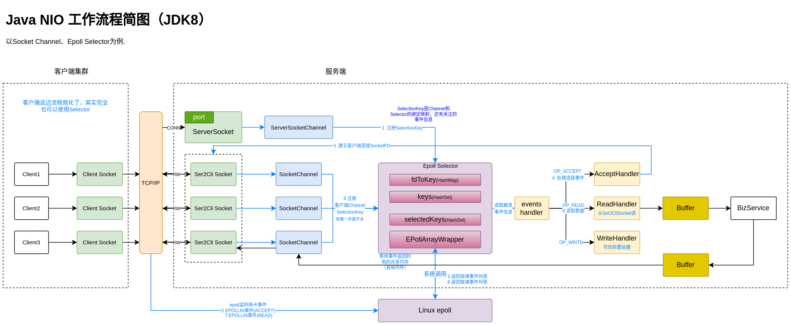

# java io

## IO模型

关于UNIX IO模型详细参考《Unix网络编程》，不常用的话细节背是记不住的，这里只要强调其核心区别。

+ **阻塞IO模型**（Blocking IO, BIO）

  强调是调用**阻塞型的系统调用**后，用户线程被阻塞，转到内核空间处理等到数据就绪，阻塞的系统调用才返回；之后用户线程解除阻塞状态。

  **服务端实现**：

  每接收到一个客户端请求，就开一个线程然后调用阻塞IO系统调用阻塞当前线程直到数据就绪，通过socket连接返回数据。

  **特点**：

  + 阻塞时不会占用CPU资源

  + 不适用并发量大的应用

    因为会阻塞线程，现在都用线程数有限的线程池管理线程，对于耗时较长的IO操作，阻塞会一直占用线程，很容易导致线程池可用线程耗尽。

  > 一些系统调用支持传参设置阻塞还是非阻塞模式。

+ **非阻塞IO模型** (Non-blocking IO)

  强调是调用**非阻塞型的系统调用**后，系统调用会立即返回不会阻塞，可能返回已经就绪的数据、也可能数据还未就绪返回一个错误码；如果数据未就绪就需要不断轮询重新调用直到获取就绪的数据。

  **服务端实现**：

  每接收到一个客户端请求就加入到请求集合，这时不需要像阻塞IO那样每次都创建一个线程了，而是大循环中每次循环都遍历所有请求看数据是否就绪。

  伪代码：

  ```java
  //每次接收到新的请求，将请求加入requests集合
  
  //请求处理循环
  while(true) {
      //遍历所有请求看结果是否就绪
  	for(request: requests) {
  	 	Object responseData = service.recvFrom(request);
          //不会阻塞但是返回值可能未就绪
          if (resposneData != null) { //返回值已就绪
              requests.remove(request);
              request.write(responseData); //通过连接写返回值
          }
  	}
  }
  ```

  **特点**：

  + 容易导致CPU占用率高

    因为需要不断轮询询问内核数据是否就绪。

+ **多路复用 IO 模型** (I/O multiplexing)

  多路复用**其实是复用一个等待数据就绪的线程**，多个请求都通过同一个线程不断去轮询多个 socket 的状态，只有当 socket 真正有读写事件时，才真正调用实际的 IO 读写操作。

  这个轮询的过程Linux系统内核直接封装成了系统调用，对应系统调用：select、poll、epoll （Java NIO 使用epoll）。

  和非阻塞IO还是有点像的，不过比非阻塞IO效率高，原因：

  非阻塞IO每次轮询都是在用户空间直接调用IO读写操作；多路复用的轮询则是在内核空间进行的（通过epoll等系统调用封装在内核空间执行），且只有有读写事件才会调用读写操作。

  

+  **信号驱动IO模型** (Signal-driven I/O)

  基于回调机制，当用户线程发起一个 IO 请求操作，会给对应的 socket 注册一个信号函数，然后用户线程直接返回，当内核数据就绪时会回调信号函数，会通过信号参数传参携带一个信号给用户线程，用户线程接收到信号之后，便在信号函数中调用 IO 读写操作来进行实际的 IO 请求操作。

+ **异步IO模型** (Asynchronous I/O)

  当用户线程发起一个IO请求操作（aio_read()），用户进程直接返回（不阻塞），当内核数据就绪时会直接将数据拷贝到用户线程（通过系统调用参数指针，比如下面的 &cb）。

  ```c
  struct aiocb cb;
  memset(&cb, 0, sizeof(struct aiocb));
  cb.aio_fildes = fd;
  cb.aio_buf = buf;
  cb.aio_nbytes = BUF_SIZE;
  cb.aio_offset = 0;
  
  if (aio_read(&cb) == -1) {
      perror("aio_read");
      exit(EXIT_FAILURE);
  }
  
  // Wait until the read operation is completed
  while (aio_error(&cb) == EINPROGRESS);
  
  if (aio_return(&cb) > 0) {
      printf("Read data: %s\n", buf);
  } else {
      perror("aio_return");
      exit(EXIT_FAILURE);
  }
  ```

  