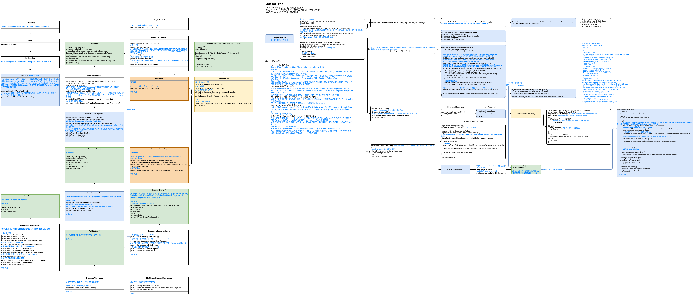
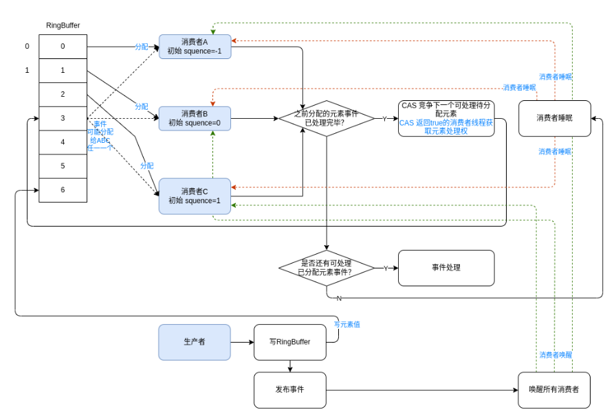

# [Disruptor](https://lmax-exchange.github.io/disruptor/)

LMAX Disruptor 的定位是 线程间高性能的消息库。

## 介绍

Disruptor是一个提供并发环形缓冲区数据结构的库。它旨在异步事件处理架构中提供低延迟、高吞吐量的工作队列。

**关键特性**：

+ 使用[消费者依赖关系图](https://lmax-exchange.github.io/disruptor/user-guide/index.html#_consumer_dependency_graph)将事件多播给消费者
+ 为事件[预分配内存](https://lmax-exchange.github.io/disruptor/user-guide/index.html#_event_pre_allocation)
+ [可选无锁](https://lmax-exchange.github.io/disruptor/user-guide/index.html#_optionally_lock_free)

**核心概念&工作原理简图**：


> 官方文档中几行文字根本说不清，需要结合后面的源码分析每个组件的作用。
>
> 看过源码重新解释这些组件发现还是不容易说清楚，还是看源码流程图吧。

+ **Ring Buffer**

  环形缓冲，是事件的存储容器；

  容量必须是2的指数幂(2^n)，当生产速度大于消费速度导致事件累积填满缓冲后缓冲区不会扩容而是让生产者等待。

  RingBuffer 在 Sequencer (当前只有 MultiProducerSequencer 这个实现) 中定义了两种主要指针：

  + 缓冲写指针 cursor 

    当缓冲为空时 cursor + 1 是环形缓冲中下一个可写位置，如果缓冲不为空则需要综合 cursor 和所有消费者消费进度判断 cursor + 1 是否可写（可能之前写的还没消费，这时写应该等待）。

  +  与 RingBuffer 绑定的所有消费者的消费指针 gatingSequences

    记录 RingBuffer 所有消费者的消费进度。

  当缓冲无事件可消费，消费者线程也需要等待，Disruptor 提供了 8 种等待策略，具体参考 Wait Strategy。

+ **Sequence**

  用作**缓冲指针**，存储指针值的是 long 类型的 value，这样指针值基本不会用尽；
  另外在 value 前后分别填充了 56 字节空字段，这个是为了防止内存伪共享问题；
  还借用 `VarHandle` 实现对 value 的安全访问和修改。

  上面说的指针都是 Sequence 类型。

+ **Sequencer**

  负责3种任务：

  + 存储缓冲写指针和消费者的消费指针

  + 借助 waitStrategy 实现生产者和消费者间的等待唤醒

  + 借助 avaliableBuffer 标记缓冲中哪些元素是可读的

    cursor 在生产者抢占位置成功后就移动了，但是发布数据可能失败，所以还需要这个标记下是否发布成功

+ **Sequence Barrier**

  消费者中通过这个对象记录与绑定的 RingBuffer 的联系（包括设置的等待策略、RingBuffer的cursor指针），用于确定是否有事件可供消费者处理以及在没有事件可处理时的等待策略。

+ **Wait Strategy**

  消费者没有事件可消费时的等待策略，Disruptor 提供了 8 种等待策略：

  + BlockingWaitStrategy

    用到等待唤醒机制，消费者在没有可消费的事件后调用wait() 等待；生产者发布事件后通过 notifyAll() 唤醒所有消费者。

  + BusySpinWaitStrategy

    通过 JDK9 的 Thread.onSpinWait() 自旋忙等待（自旋是通过while），直到有事件可以消费。

    很浪费CPU资源，尽量不要用。

    ```java
    while ((availableSequence = dependentSequence.get()) < sequence) {
        barrier.checkAlert();
        //方法本身没有实际的代码逻辑，但通过 @IntrinsicCandidate 注解，JIT 编译器可以将其优化为更高效的等待指令，适用于自旋锁等同步机制中的忙等待场景
        //暂不清楚有什么优化，看系统监控发现还是会将某个核心占用到100%
        Thread.onSpinWait();
    }
    ```

  + LiteBlockingWaitStrategy

    CAS + 等待唤醒机制。

  + TimeoutBlockingWaitStrategy

    带超时的等待唤醒机制。

  + LiteTimeoutBlockingWaitStrategy

    CAS + 带超时的等待唤醒机制。

  + PhasedBackoffWaitStrategy

    自定义（fallbackStrategy）+ 带yield() 的自旋等待。

  + SleepingWaitStrategy

    带睡眠的自旋等待。

  + YieldingWaitStrategy

    带 yield() 的自旋等待。

+ **Event**

  事件，即发布的数据的数据类型，并没有对应的接口。

+ **Event Processor**

  事件处理器，属于消费者中的重要组成部分，包含事件处理逻辑，保持消费者消费进度等信息。

+ **Event Handler**

  事件处理接口，实现此接口定义事件处理逻辑。

+ **Producer**

  生产者，需要先调用 RingBuffer next() 抢占位置（CAS 保证线程安全），然后才能在此位置通过 RingBuffer publish 方法发布事件数据。

## 原理

### 工作原理

结合官方提供的案例（examples/.../longevent/legacy/LongEventMain.java）调试 Disruptor 工作流程。

整体和其他地方见到的环形缓冲、滑动窗口操作类似，通过“双”指针读写（这里是指两类指针：写指针、消费指针）。



**看源码过程中的疑问与看完后的解答**：

- **Disruptor 生产消费逻辑**
  事件生产：
  生产者首先向 RingBuffer 中申请占位，多个生产者都通过 RingBuffer next() 占位，内部通过 CAS 抢占位置，如果缓冲写满就根据选择的等待策略处理；
  生产者占位成功后，RingBuffer cursor 指针+1, 生产者向对应位置写数据成功后在 availableBuffer 标记此位置数据可用；然后通过 Sequencer 中的 waitStrategy 唤醒对应的消费者组进行消费
  事件消费：
  消费者线程被唤醒后，结合 RingBuffer 当前可读位置和自己的消费进度，读取所有可以被消费的事件，遍历事件进行消费，消费完成后更新自己的消费进度。

- **RingBuffer 存满后怎么处理的？**
  修改测试将bufferSize设置为4, 消费者线程全部通过断点阻塞，然后生产者不断往RingBuffer 发布数据，当写指针比消费指针快一轮之后会根据阻塞策略选择不同方式处理，比如默认的BlockingWaitStrategy会**自旋等待**，直到有空位可写。
  实际使用时需要根据业务量调整缓冲大小，尽量不要让缓冲占尽，否则后面写入会被阻塞。

- **为何要每个消费者都创建一个线程？不会造成线程数量太多么？**

  感觉是受等待策略的限制导致的，比如使用 BlockingWaitStrategy，使用的 Java 等待唤醒机制，就没法再使用线程池了。
  不过这个问题确实存在。不知能否使用 JDK21的虚线程优化，TODO。

- **为何 Sequence value 前后要填充 56 字节?**
  填充字节是为了解决伪共享内存问题，但是为何要前后分别填充 56 字节？因为 value 本身是long类型占8个字节，缓冲行的长度是64字节，所以前后分别填充56字节可以与其他数据拉开足够的距离避免出现伪共享。

  - **RingBuffer 中的填充方式呢？**

    RingBuffer 在 RingBufferFields 前后各填充 56 字节，在 RingBufferFields.entries 前后各填充32字节。TODO ???

- **多生产者与多消费者怎么保持 Sequence 指针线程安全的？**
  多个生产者发布数据到同一个 RingBuffer 实例前，需要先通过 RingBuffer next() 方法占位，这个方法内部基于CAS是线程安全的；成功占位后再在 RingBuffer 相应的位置写数据；
  对于多消费者由于当前测试每个消费者维护自己的消费进度（即广播模式），根本不存在并发问题；
  那么Disruptor支持分摊消费的模式么？
  从当前版本事件处理器唯一的实现类 BatchEventProcessor 看暂时不支持分摊消费，因为
  其记录消费进度是靠私有成员变量 sequence，而这个值不会被外部修改，只有消费者本身消费事件后会更新，要实现分摊消费，这些消费者需要共享一个消费进度。

### 高性能实现原理

+ **事件存储预分配** Event Pre-allocation

  存储事件数据的 RingBuffer 元素数组是预先分配好的，且数组元素对象不会被回收，避免了频繁的GC，且是固定大小的（一旦指定不能运行时修改）不存在扩容复制。

  > 数组元素不会被回收是因为发布事件时是对旧的事件对象执行 set() 修改事件数据而不是设置一个新的事件对象。这样**避免频繁GC**的同时**还避免了伪共享问题**，比如读取一个元素的同时另一个线程修改了临近元素并不会导致前面读缓存行的失效，因为只是修改事件对象中的值，数组元素不会变（Event对象引用），不会导致缓存行失效。
  >
  > 比如事件发布实现：
  >
  > ```java
  > long sequence = ringBuffer.next(); //获取 cursor 指针的下一可写索引，本质是CAS getAndAdd(1) 
  > try {
  >     //获取 sequence 指针指向的元素节点
  >     LongEvent event = ringBuffer.get(sequence);
  >     //复用之前的元素对象，修改值而不是重新建一个Event对象
  >     event.set(bb.getLong(0));	
  > } finally {
  >     ringBuffer.publish(sequence);
  > }
  > ```

  数组对CPU的高速缓存机制更友好。

  > 为何数组对CPU的高速缓存机制更友好？
  >
  > 因为**程序的局部性原理**，程序的局部性原理指的是在一段时间内程序的执行会限定在一个局部范围内。这里的“局部性”可以从两个方面来理解，一个是时间局部性，另一个是空间局部性。**时间局部性**指的是程序中的某条指令一旦被执行，不久之后这条指令很可能再次被执行；如果某条数据被访问，不久之后这条数据很可能再次被访问。而**空间局部性**是指某块内存一旦被访问，不久之后这块内存附近的内存也很可能被访问。
  >
  > 数组相对于链表，元素空间都是连续的，**写缓存行时，缓存某元素的同时会缓存临近元素**，下次访问临近元素时就不需要再从主内存一步步加载了，速度更快，这就体现了**空间局部性**。

+ **数组长度为2的指数幂，可以用位运算计算索引**

+ **可选无锁设计**

  生产者发布事件前需要先通过 RingBuffer next() 占位，内部借助 CAS 实现，占位成功后再写数据。

  Disruptor 团队测试两个线程并发CAS性能比加锁性能大概快1个数量级。

+ **消除伪共享问题，避免因为缓存失效重新读主内存引起的性能损失**

  Disruptor 消除伪共享同样是通过留白（padding）的方式。

  Java8 中添加了一个 @Contended 注解，可以自动在被注解的字段前后进行缓存行填充，但是必须加上虚拟机参数 `-XX:-RestrictContended`，@Contended注释才会生效，不知道是不是因为这个原因 Disruptor 没有使用此注解。

  关于伪共享可以参考：[伪共享原理&性能对比实战](https://www.cnblogs.com/crazymakercircle/p/13909102.html)

+ **可选单生产者模式**

  如果业务中只有一个生产者线程，可以在 Disruptor 中配置 ProducerType.SINGLE，因为根本不存在并发上面的 CAS 也不需要了，这时写性能最高（单一写者原则）。

+ **借助 UNSAFE 、VarHandle 代替数组索引取值**

## 优劣

Disruptor 和借助 BlockingQueue 等队列实现的生产者消费者模式的区别：

+ Disruptor 支持组播，BlockingQueue 等队列不支持

  个人感觉说支持**广播**更合适，因为看源码不同组的消费者只要是绑定到同一 RingBuffer 都是维持各自私有的消费进度，即发的消息即便同一组消费者也都会各自消费一遍。

  > 组播给人的感觉好像是这组的消费者会分摊消费，像RocketMQ、Kafka等消息中间件同一组消费者都是分摊消费。

+ Disruptor 比 BlockingQueue 等队列性能更好

  TODO，队列的内部原理忘的差不多了

+ Disruptor 4.x  消费者线程不会复用，每启动一个消费者就会创建一个线程

  需要注意业务中要复用消费者实例，而不是创建很多消费者实例。

  TODO，3.x 中看接口还有线程池的概念，拿线程池做了什么？为何 4.x 中去掉了？

## 场景

+ 生产者消费者场景
+ 发布订阅场景
+ 高性能低延迟场景

## 应用

[User Guide](https://lmax-exchange.github.io/disruptor/user-guide/index.html)

Disruptor 支持3种编码风格（Lambda、Lagacy、MethodRef）。

### 生产消费模式

生产者可以设置单生产者多生产者，单生产者时，不需要使用任何线程安全措施，多生产者默认使用 CAS 保护线程安全；
消费者也可以设置单消费者和多消费者，使用 `handleEventsWith` 设置多消费者时各个消费者各自维护消费进度，是广播模式。

不过看某个网文[Disruptor 原理、架构、源码 一文穿透](https://blog.csdn.net/crazymakercircle/article/details/128264803)，发现消费者还存在其他消费模式，比如**多消费者竞争模式**（一个事件仅仅会被一组消费者中某个消费者消费）、**多消费者串行消费模式**（每个消费者都会消费一次事件但是是有顺序的）、**多消费者菱形消费模式**、**链式并行模式**，官网好像没说所以也没有注意，这里研究下对应的实现原理。

对应实现原理：

+ **多消费者竞争模式**

  用的 `handleEventsWithWorkerPool`方法绑定消费者，3.x版本还存在这个方法，但是 4.0.0 版本已经没有这个方法了。

  关于为什么将 WokerPool 从 Disruptor 中去除？参考：https://github.com/LMAX-Exchange/disruptor/issues/323，
  只是因为 LMAX 项目中并不使用 WorkerPool ，维护者又不想维护这部分代码。

  如果项目中想要使用可以将 Disruptor3.x 中 WorkerPool 相关的代码拷贝到项目代码中，参考：https://github.com/LMAX-Exchange/disruptor/issues/467，有人给了一个演示： disruptor4.0 中使用 WorkerPool。

  实现原理**基于 ReetrantLock Condition 等待唤醒，多个处理器共用一个处理进度 Sequence workSequence；workSequence 值可以理解为是这组处理器下一个待分配的RingBuffer事件索引，多个处理器通过 CAS 竞争 workSequence 索引位置的事件的处理**。

  当发布事件后同样是唤醒所有等待的消费者，但是这种模式注册事件处理器时每个处理器初始处理进度设置的不一样，比如测试中设置两个处理器 `disruptor.handleEventsWithWorkerPool(new LongEventWorkHandler(1), new LongEventWorkHandler(2));`， 调试可以看到第一个注册的处理器的初始处理进度是-1，第二个注册的处理器的初始处理进度是0，而对于广播模式全是 -1。

  ```java
  lock.lock();
  try {
      processorNotifyCondition.signalAll();
  } finally {
      lock.unlock();
  }
  
  // 处理器被唤醒后，还需要判断 RingBuffer 的可用元素最大索引是否 >= 处理器下一可处理进度, 即当前处理器是否可以处理事件
  // 否则的话会立马再次进入睡眠
  // 比如共有处理器A、B, 启动后初始处理进度分别设置 -1 0, workSequence初始是1
  // RingBuffer首次发布数据 0, 是写在 RingBuffer 0号索引（cursorSequence=0）， 写完唤醒A、B，
  // A: cursorSequence(0) = nextSequence(0), A满足处理事件条件，最终会调用处理方法，并更新自己的处理进度(更新参考后面那段代码)，最终 sequence = 1, workSequece = 2
  // B: cursorSequence(0) < nextSequence(1), B不满足处理事件条件，再次等待
  // 注意也可能事件发布间隔很短，唤醒后已经有多个事件可处理
  while (cursorSequence.get() < sequence)	//这里的sequence 其实是 nextSequence
  {
      barrier.checkAlert();
      processorNotifyCondition.await();
      System.out.println(Thread.currentThread().getName() + " has been waken up," + " cursorSequence="
                         + cursorSequence.get() + ", sequence=" + sequence);
  }
  
  // 处理器每次处理完一个事件后都会更新自己的处理进度和共用的处理进度 workSequence.
  // sequence 是 WorkProcessor 初始处理进度，nextSequence 是分配给此处理器的待处理的RingBuffer元素索引，workSequence 的值为何要是所有处理器sequence最大值+1, 是因为初始的几个元素已经分配好了消费者，比如3个消费者，索引 0 1 2 的元素给谁处理已经定好了
  long nextSequence = sequence.get();
  T event = null;
  while (true) {
      try {
          // 处理器处理完一个事件再去竞争下一个未分配的元素
          if (processedSequence) {
              processedSequence = false;
              do {
                  nextSequence = workSequence.get() + 1L;
                  sequence.set(nextSequence - 1L);
              } // 通过CAS竞争下一个待分配的事件, 返回true 的处理器获取对nextSequence 元素的处理权
              while (!workSequence.compareAndSet(nextSequence - 1L, nextSequence));
          }
          
          // cachedAvaliableSequence 是处理器线程被唤醒后可处理最大元素索引
          // nextSequence 是分配给此处理器的待处理的RingBuffer元素索引
          if (cachedAvailableSequence >= nextSequence) {
              event = ringBuffer.get(nextSequence);
              workHandler.onEvent(event); // 回调 onEvent() 处理事件
              processedSequence = true;
          } else {
              // 没有更多可处理的事件就继续等待
              cachedAvailableSequence = sequenceBarrier.waitFor(nextSequence);
          }
      } catch (final TimeoutException e) {
          notifyTimeout(sequence.get());
      } catch (final AlertException ex) {
          if (!running.get()) {
              break;
          }
      } catch (final Throwable ex) {
          // handle, mark as processed, unless the exception handler threw an exception
          exceptionHandler.handleEventException(ex, nextSequence, event);
          processedSequence = true;
      }
  }
  ```

  画个图更好理解：

  

+ **多消费者串行消费模式**

  实现串行消费的原理是**将上一个消费者的消费进度作为下一个消费者的依赖进度**，在等待策略 waitFor() 方法中则有条件**要求**

  **当前消费者消费进度不大于依赖进度才能继续执行处理否则会自旋等待依赖进度满足条件**。

  ```java
  public long waitFor(final long sequence, final Sequence cursorSequence, final Sequence dependentSequence, 	final SequenceBarrier barrier)
      throws AlertException, InterruptedException {
      long availableSequence;
      if (cursorSequence.get() < sequence) {
          synchronized (mutex) {
              while (cursorSequence.get() < sequence) {
                  barrier.checkAlert();
                  mutex.wait();
              }
          }
      }
  	// 被唤醒后还需要当前消费者的消费进度(sequence)不大于依赖进度(dependentSequence)才能跳出等待去处理事件，否则会自旋等待
      while ((availableSequence = dependentSequence.get()) < sequence) {
          barrier.checkAlert();
          Thread.onSpinWait();
      }
  
      return availableSequence;
  }
  ```

  举个例子有3个消费者ABC，通过 `EventHandlerGroup#next(...)` 串联ABC后，C依赖B的消费进度、B依赖A的消费进度、A默认还是依赖RingBuffer的cursor；发布一个事件 ABC 都被唤醒，对A来说，上面 `while ((availableSequence = dependentSequence.get()) < sequence)` 为false 不会自旋等待，直接执行 A的事件处理，对 B 来说因为依赖 A的消费进度，A还未消费完成前，dependentSequence=-1 sequence=0 while 条件为 true, 会自旋等待，当A消费完成后可以dependentSequence=0   while 返回 false, B才能执行事件处理，C同理。

+ **多消费者菱形消费模式**

  其实是广播以及顺序消费的结合。

  比如下面案例：消费者1、2并发广播消费，消费者1、2都消费完毕消费者3再消费。

  ```java
  disruptor.handleEventsWith(new LongEventHandler(1), new LongEventHandler(2))
      .then(new LongEventHandler(3));
  ```

+ **链式并行模式**

  就是设置多组顺序消费者，比如：

  ```java
  disruptor.handleEventsWith(new LongEventHandler(11))
      .then(new LongEventHandler(12));
  disruptor.handleEventsWith(new LongEventHandler(21))
      .then(new LongEventHandler(22));
  ```

### 批量倒带

如果在处理可恢复的事件时出现错误，用户可以抛出`RewindableException`。这将调用`BatchRewindStrategy`而不是通常的`ExceptionStrategy`来决定是否应该将序列号倒回到要重试的批处理的开头，或者重新抛出并委托给`ExceptionStrategy`处理。

批处理的开头即事件消费者这次被唤醒后处理的第一个事件的索引。

## 参考

+ [ Disruptor 原理、架构、源码 一文穿透](https://blog.csdn.net/crazymakercircle/article/details/128264803)

  内存伪共享等问题可以参考。

