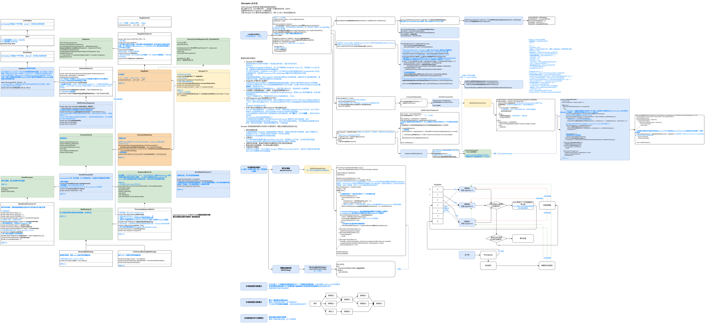

# [Disruptor](https://lmax-exchange.github.io/disruptor/)

LMAX Disruptor 的定位是 线程间高性能的消息库。

## 介绍

Disruptor是一个提供并发环形缓冲区数据结构的库。它旨在异步事件处理架构中提供低延迟、高吞吐量的工作队列。

**关键特性**：

+ 使用[消费者依赖关系图](https://lmax-exchange.github.io/disruptor/user-guide/index.html#_consumer_dependency_graph)将事件多播给消费者
+ 为事件[预分配内存](https://lmax-exchange.github.io/disruptor/user-guide/index.html#_event_pre_allocation)
+ [可选无锁](https://lmax-exchange.github.io/disruptor/user-guide/index.html#_optionally_lock_free)

**核心概念&工作原理简图**：


> 官方文档中几行文字根本说不清，需要结合后面的源码分析每个组件的作用。
>
> 看过源码重新解释这些组件发现还是不容易说清楚，还是看源码流程图吧。

+ **Ring Buffer**

  环形缓冲，是事件的存储容器；

  容量必须是2的指数幂(2^n)，当生产速度大于消费速度导致事件累积填满缓冲后缓冲区不会扩容而是让生产者等待。

  RingBuffer 在 Sequencer (当前只有 MultiProducerSequencer 这个实现) 中定义了两种主要指针：

  + 缓冲写指针 cursor 

    当缓冲为空时 cursor + 1 是环形缓冲中下一个可写位置，如果缓冲不为空则需要综合 cursor 和所有消费者消费进度判断 cursor + 1 是否可写（可能之前写的还没消费，这时写应该等待）。

  +  与 RingBuffer 绑定的所有消费者的消费指针 gatingSequences

    记录 RingBuffer 所有消费者的消费进度。

  当缓冲无事件可消费，消费者线程也需要等待，Disruptor 提供了 8 种等待策略，具体参考 Wait Strategy。

+ **Sequence**

  用作**缓冲指针**，存储指针值的是 long 类型的 value，这样指针值基本不会用尽；
  另外在 value 前后分别填充了 56 字节空字段，这个是为了防止内存伪共享问题；
  还借用 `VarHandle` 实现对 value 的安全访问和修改。

  上面说的指针都是 Sequence 类型。

+ **Sequencer**

  负责3种任务：

  + 存储缓冲写指针和消费者的消费指针

  + 借助 waitStrategy 实现生产者和消费者间的等待唤醒

  + 借助 avaliableBuffer 标记缓冲中哪些元素是可读的

    cursor 在生产者抢占位置成功后就移动了，但是发布数据可能失败，所以还需要这个标记下是否发布成功

+ **Sequence Barrier**

  消费者中通过这个对象记录与绑定的 RingBuffer 的联系（包括设置的等待策略、RingBuffer的cursor指针），用于确定是否有事件可供消费者处理以及在没有事件可处理时的等待策略。

+ **Wait Strategy**

  消费者没有事件可消费时的等待策略，Disruptor 提供了 8 种等待策略：

  + BlockingWaitStrategy

    用到等待唤醒机制，消费者在没有可消费的事件后调用wait() 等待；生产者发布事件后通过 notifyAll() 唤醒所有消费者。

  + BusySpinWaitStrategy

    通过 JDK9 的 Thread.onSpinWait() 自旋忙等待（自旋是通过while），直到有事件可以消费。

    很浪费CPU资源，尽量不要用。

    ```java
    while ((availableSequence = dependentSequence.get()) < sequence) {
        barrier.checkAlert();
        //方法本身没有实际的代码逻辑，但通过 @IntrinsicCandidate 注解，JIT 编译器可以将其优化为更高效的等待指令，适用于自旋锁等同步机制中的忙等待场景
        //暂不清楚有什么优化，看系统监控发现还是会将某个核心占用到100%
        Thread.onSpinWait();
    }
    ```

  + LiteBlockingWaitStrategy

    CAS + 等待唤醒机制。

  + TimeoutBlockingWaitStrategy

    带超时的等待唤醒机制。

  + LiteTimeoutBlockingWaitStrategy

    CAS + 带超时的等待唤醒机制。

  + PhasedBackoffWaitStrategy

    自定义（fallbackStrategy）+ 带yield() 的自旋等待。

  + SleepingWaitStrategy

    带睡眠的自旋等待。

  + YieldingWaitStrategy

    带 yield() 的自旋等待。

+ **Event**

  事件，即发布的数据的数据类型，并没有对应的接口。

+ **Event Processor**

  事件处理器，属于消费者中的重要组成部分，包含事件处理逻辑，保持消费者消费进度等信息。

+ **Event Handler**

  事件处理接口，实现此接口定义事件处理逻辑。

+ **Producer**

  生产者，需要先调用 RingBuffer next() 抢占位置（CAS 保证线程安全），然后才能在此位置通过 RingBuffer publish 方法发布事件数据。

## 原理

### 工作原理

结合官方提供的案例（examples/.../longevent/legacy/LongEventMain.java）调试 Disruptor 工作流程。

整体和其他地方见到的环形缓冲、滑动窗口操作类似，通过“双”指针读写（这里是指两类指针：写指针、消费指针）。



**看源码过程中的疑问与看完后的解答**：

- **Disruptor 生产消费逻辑**
  事件生产：
  生产者首先向 RingBuffer 中申请占位，多个生产者都通过 RingBuffer next() 占位，内部通过 CAS 抢占位置，如果缓冲写满就根据选择的等待策略处理；
  生产者占位成功后，RingBuffer cursor 指针+1, 生产者向对应位置写数据成功后在 availableBuffer 标记此位置数据可用；然后通过 Sequencer 中的 waitStrategy 唤醒对应的消费者组进行消费
  事件消费：
  消费者线程被唤醒后，结合 RingBuffer 当前可读位置和自己的消费进度，读取所有可以被消费的事件，遍历事件进行消费，消费完成后更新自己的消费进度。

- **RingBuffer 存满后怎么处理的？**
  修改测试将bufferSize设置为4, 消费者线程全部通过断点阻塞，然后生产者不断往RingBuffer 发布数据，当写指针比消费指针快一轮之后会根据阻塞策略选择不同方式处理，比如默认的BlockingWaitStrategy会**自旋等待**，直到有空位可写。
  实际使用时需要根据业务量调整缓冲大小，尽量不要让缓冲占尽，否则后面写入会被阻塞。

- **为何要每个消费者都创建一个线程？不会造成线程数量太多么？**

  感觉是受等待策略的限制导致的，比如使用 BlockingWaitStrategy，使用的 Java 等待唤醒机制，就没法再使用线程池了。
  不过这个问题确实存在。不知能否使用 JDK21的虚线程优化，TODO。

- **为何 Sequence value 前后要填充 56 字节?**
  填充字节是为了解决伪共享内存问题，但是为何要前后分别填充 56 字节？因为 value 本身是long类型占8个字节，缓冲行的长度是64字节，所以前后分别填充56字节可以与其他数据拉开足够的距离避免出现伪共享。

  - **RingBuffer 中的填充方式呢？**

    RingBuffer 在 RingBufferFields 前后各填充 56 字节，在 RingBufferFields.entries 前后各填充32字节。TODO ???

- **多生产者与多消费者怎么保持 Sequence 指针线程安全的？**
  多个生产者发布数据到同一个 RingBuffer 实例前，需要先通过 RingBuffer next() 方法占位，这个方法内部基于CAS是线程安全的；成功占位后再在 RingBuffer 相应的位置写数据；
  对于多消费者由于当前测试每个消费者维护自己的消费进度（即广播模式），根本不存在并发问题；
  那么Disruptor支持分摊消费的模式么？
  从当前版本事件处理器唯一的实现类 BatchEventProcessor 看暂时不支持分摊消费，因为
  其记录消费进度是靠私有成员变量 sequence，而这个值不会被外部修改，只有消费者本身消费事件后会更新，要实现分摊消费，这些消费者需要共享一个消费进度。

### 高性能实现原理

+ **事件存储预分配** Event Pre-allocation

  存储事件数据的 RingBuffer 元素数组是预先分配好的，数组元素不会被回收，避免了频繁的GC，且是固定大小的（一旦指定不能运行时修改）不存在扩容复制。

  数组对处理器的缓存机制更友好。

+ **数组长度为2的指数幂，可以用位运算计算索引**

+ **可选无锁设计**

  生产者发布事件前需要先通过 RingBuffer next() 占位，内部借助 CAS 实现，占位成功后再写数据。

  Disruptor 团队测试两个线程并发CAS性能比加锁性能大概快1个数量级。

+ **消除伪共享问题，避免因为缓存失效重新读主内存引起的性能损失**

  Disruptor 消除伪共享同样是通过留白（padding）的方式。

  Java8 中添加了一个 @Contended 注解，可以自动在被注解的字段前后进行缓存行填充，但是必须加上虚拟机参数 `-XX:-RestrictContended`，@Contended注释才会生效，不知道是不是因为这个原因 Disruptor 没有使用此注解。

  关于伪共享可以参考：[伪共享原理&性能对比实战](https://www.cnblogs.com/crazymakercircle/p/13909102.html)

+ **可选单生产者模式**

  如果业务中只有一个生产者线程，可以在 Disruptor 中配置 ProducerType.SINGLE，那么上面的 CAS 也不需要了，这时写性能最高（单一写者原则）。

  

## 优劣

Disruptor 和借助 BlockingQueue 等队列实现的生产者消费者模式的区别：

+ Disruptor 支持组播，BlockingQueue 等队列不支持

  个人感觉说支持**广播**更合适，因为看源码不同组的消费者只要是绑定到同一 RingBuffer 都是维持各自私有的消费进度，即发的消息即便同一组消费者也都会各自消费一遍。

  > 组播给人的感觉好像是这组的消费者会分摊消费，像RocketMQ、Kafka等消息中间件同一组消费者都是分摊消费。

+ Disruptor 比 BlockingQueue 等队列性能更好

+ 

## 场景

+ 生产者消费者场景
+ 发布订阅 场景
+ 性能要求高延迟要求低的场景

## 应用

[User Guide](https://lmax-exchange.github.io/disruptor/user-guide/index.html)

Disruptor 支持3种编码风格（Lambda、Lagacy、MethodRef）。