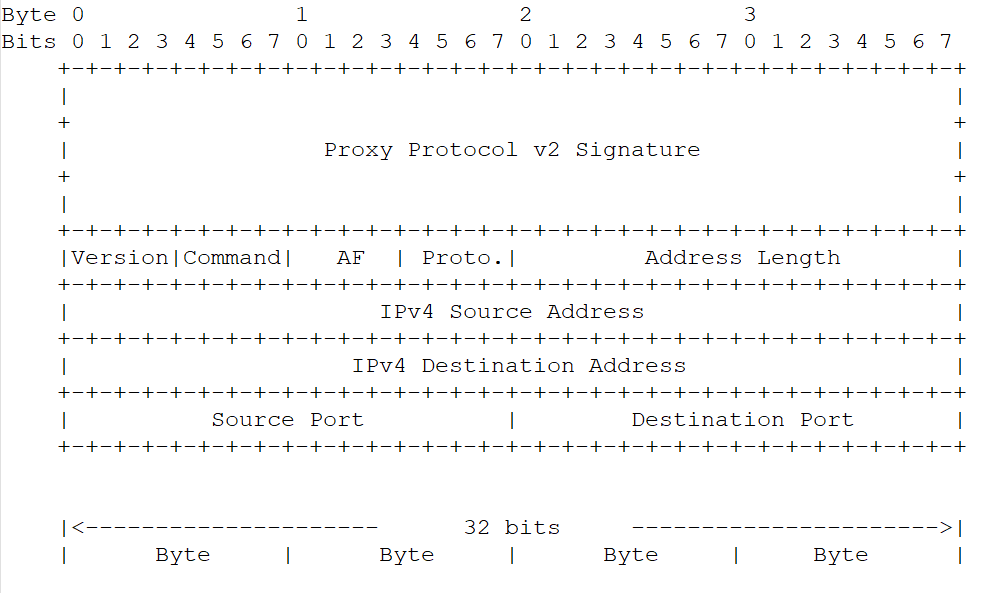

# Proxy Protocol

[Proxy Protocol 规范](https://www.haproxy.org/download/1.8/doc/proxy-protocol.txt)

[中文翻译](https://cloudnative.to/blog/proxy-protocol/)

Proxy Protocol 是 HAProxy 提供的一种代理协议，提供了一种方便的方式，可以安全地**传输连接信息**，例如客户端的地址，跨越多层 NAT 或 TCP 代理。它旨在对现有组件进行少量更改，并限制由传输信息处理引起的性能影响。

可以当作是传输层协议的拓展。

解决的主要痛点：通过代理中继 TCP 连接通常会导致原始 TCP 连接参数的丢失，例如源地址、目标地址、端口等等。

更多内容参考“背景”部分。

> 看到 RocketMQ Netty连接中有支持 Proxy Protocol，所以了解一下。
>
> 找到两篇文章，可以参考引入 Proxy Protocol 体验一下：
>
> [netty系列之:小白福利！手把手教你做一个简单的代理服务器](http://www.flydean.com/35-netty-simple-proxy/)
>
> [netty系列之:在netty中使用proxy protocol](https://cloud.tencent.com/developer/article/2170703)


## Proxy Protocol 协议头部结构

现在一般使用版本2，这里只展示版本2的协议头部结构。

这张图展示的是Proxy Protocol 对 IPv4协议的头结构定义（不同传输协议在Address Length块后有差异）：差异



+ Proxy Protocol v2 Signature

  长度为12字节的固定字节块。注意该块在第 5 个位置包含一个空字节，因此不得将其视为以空字符结尾的字符串。

+ Command

  + 0x0 : LOCAL，非代理连接，没有中继。
  + 0x1 : PROXY，连接是代表另一个节点建立的。

+ AF

  + 0x0 : AF_UNSPEC，未知、未指定或不支持的协议。
  + 0x1 : AF_INET，使用 AF_INET 地址族（IPv4）。
  + 0x2 : AF_INET6，使用 AF_INET6 地址族（IPv6）。
  + 0x3 : AF_UNIX，使用 AF_UNIX 地址族。

+ Proto

  + 0x0 : UNSPEC
  + 0x1 : STREAM
  + 0x2 : DGRAM

+ Address Length

  + AF段对应协议网络地址长度。

对比后面抓取的字节数组内容：

```shell
13, 10, 13, 10, 
0, 13, 10, 81, 
85, 73, 84, 10, 
33, 17, 0, 12, 
127, 0, 0, 1, 
127, 0, 0, 2, 
31, 64, 35, 40
# 转成16进制，可以看到和代码中设置的头部数据一致（HAProxyMessage）
0D 0A 0D 0A		# Proxy Protocol v2 签名 (这3行，包括12个字节)
00 0D 0A 51		
55 49 54 0A
21 11 00 0C		# 2(版本2)1(命令：PROXY) 1(传输协议：AF_INET)1(地址族：STREAM) 00 0C (AF协议地址长度，这里是IPV4地址所以长度是12)
7F 00 00 01		# 源地址
7F 00 00 02		# 目标地址
1F 40 23 28		# 0x1F40(源端口：8000) 2328（目标端口，9000）
```

Netty 对 Proxy Protocol 头部的封装 `HAProxyMessage` ：

```java
private final ResourceLeakTracker<HAProxyMessage> leak;
//Proxy Protocol 版本，目前有两个版本：V1(16) V2(32)，版本值使用一个字节表示
private final HAProxyProtocolVersion protocolVersion;
//LOCAL or Proxy
private final HAProxyCommand command;
//被代理的协议
private final HAProxyProxiedProtocol proxiedProtocol;
//源地址
private final String sourceAddress;
//目标地址
private final String destinationAddress;
//源端口
private final int sourcePort;
//目标端口
private final int destinationPort;
//？？？
private final List<HAProxyTLV> tlvs;
```

Netty 还提供了`HAProxyMessageEncoder` 、`HAProxyMessageDecoder`实现对 HAProxyMessage 头部数据的编解码。

客户端发送Proxy协议消息：

```java
HAProxyMessage message = new HAProxyMessage(
    HAProxyProtocolVersion.V2, HAProxyCommand.PROXY, HAProxyProxiedProtocol.TCP4,
    "127.0.0.1", "127.0.0.2", 8000, 9000);
//可以看到使用Proxy Protocol很简单，仅仅就是在连接建立后，最开始多传一个 Proxy Protocol 头部消息。
//服务端则需要在用 HAProxyMessageDecoder 解码后得到 HAProxyMessage 后，将头部消息中的连接信息存储起来，以备后续业务使用
ch.writeAndFlush(message).sync();
ch.writeAndFlush(Unpooled.copiedBuffer("this is a proxy protocol message!", CharsetUtil.UTF_8)).sync();
```

重写LoggingHandler，监听 HAProxyMessage 的二进制内容：

```java
static class LoggingExtraHandler extends LoggingHandler {
    public LoggingExtraHandler(LogLevel level) {
        super(level);
    }

    @Override
    public void channelRead(ChannelHandlerContext ctx, Object msg) throws Exception {
        //需要修改日志配置将日志等级修改为debug
        if (logger.isEnabled(internalLevel)) {
            //打印HAProxy协议二进制数据
            if (msg instanceof ByteBuf) {
                ByteBuf msgBuf = (ByteBuf) msg;
                byte[] bytes = new byte[msgBuf.readableBytes()];
                msgBuf.duplicate().readBytes(bytes);
                logger.log(internalLevel, "Proxy Protocol content: {}", bytes);
            }
            logger.log(internalLevel, format(ctx, "READ", msg));
        }
        ctx.fireChannelRead(msg);
    }
}
```

读取的二进制内容是：

```
Proxy Protocol content: [13, 10, 13, 10, 0, 13, 10, 81, 85, 73, 84, 10, 33, 17, 0, 12, 127, 0, 0, 1, 127, 0, 0, 2, 31, 64, 35, 40]
```


## 使用 Netty + ProxyProtocol 协议实现代理服务器

+ 如果想实现对HTTP协议的代理呢？

  并不冲突，Proxy Protocol 可以视作是传输层协议的拓展，只需要在传输层处理Proxy Protocol头部数据即可（主要是存储起来），HTTP 是传输层之上的协议，在后续使用 HTTP 解码器解码后处理 HTTP 请求即可。


