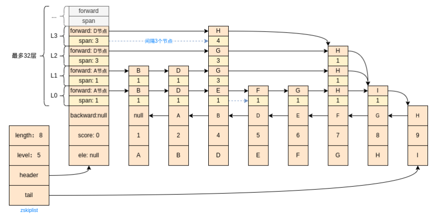

# Redis 内部数据结构

## 跳表

Redis 中跳表的实现：[ZSkipList.java](https://github.com/kwseeker/redis-model/blob/master/redis-theory/src/main/java/top/kwseeker/redis/theory/datastructure/ZSkipList.java) ；

数据结构：

1. Redis跳表中头节点（**header**）不存储元素，只是记录32层（Redis中规定最多32层）索引每一层指向的下一个节点（**forward**）和跳过的元素个数（**span**）；

2. 跳表尾节点（**tail**）指向最后一个元素节点；

3. 跳表 **level** 记录所有节点层数的最大值；检索节点时从这一层开始；

4. 插入新元素需要先从头节点最顶层开始检索，通过分值（**score**）比较查找新元素的前后元素；

   > 比如现在要插入新元素 ele: C score:3; 
   > 当前 level:4，查 L3, 从header开始发现下一个元素（ele:D, score:4）score=4 大于新元素的score, D节点作为**右边界**；
   > 继续查L2, 从header开始下一个元素还是D，已经到达**右边界**; 
   > 继续查L1, 从header开始下一个元素是A, score=1 小于新元素的score, 将A作为**左边界,** 继续查A的下一个元素是B,score=2 小于新元素的score，将B作为**左边界**, 继续查下一个元素D 到了右边界；
   > 继续查L0, 从左边界节点（B）开始下一个元素是D到了右边界；那么C就要插在B、D之间；

5. 每个元素插入时随机生成层数（层数越高概率越小），每个元素的层数最少为1层，层数决定当前节点需要记录几个forward节点；

   > 层数为 2、3、4、...  的概率分别是：1/2、1/4、1/8、...; 
   > 假设生成的新元素C的层数是5；
   > 则C元素节点中包含5个forward指针，每一层都需要指向同层指针的下一个节点；
   > 以上图为例, C元素节点
   > L4 forward: null span:0, 同时更新 header L4 forward: C节点 span:3
   > L3 forward: D节点 span: 1, 同时更新 header L3 forward: C节点 span:3
   > L2 forward: D节点 span: 1, 同时更新 header L2 forward: C节点 span:3
   > L1 forward: D节点 span: 1, 同时更新 B节点 L1 forward: C节点 span:1
   > L0 forward: D节点 span: 1, 同时更新 B节点 L0 forward: C节点 span:1

6. 每个节点还包含一个backward指针，按score形成反向链表。

