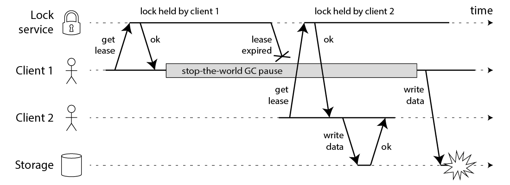
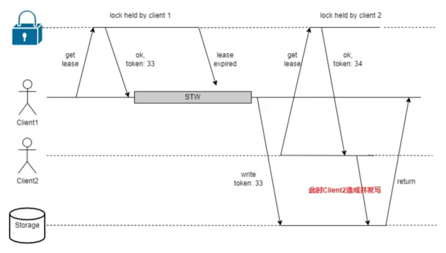

# Redisson分布式锁实现原理

Redisson分布式锁接口实现 `java.util.concurrent.locks.Lock` 接口，意味着 Redisson 的锁接口具有和 JUC 锁接口相同的语义。

Redisson 的锁都实现了**同步**、**异步**、**响应式**接口。

`Redisson`（3.29.0）几种分布式锁：


> Lock 接口是JUC中的接口。

+ RedissonLock

  核心实现，多数锁继承此锁，这些锁主要逻辑也都是在这个类中实现的。

+ RedissonFairLock

+ RedissonReadLock

+ RedissonWriteLock

+ RedissonReadWriteLock

+ RedissonFencedLock

+ RedissonSpinLock

+ RedissonMultiLock

+ RedissonRedLock (已废弃)

+ RedissonSemaphore 

  ```java
  RedissonSemaphore extends RedissonExpirable implements RSemaphore
  ```

+ RedissonPermitExpirableSemaphore

+ RedissonCountDownLatch

  ```java
  RedissonCountDownLatch extends RedissonObject implements RCountDownLatch
  ```


## 前置内容

理解分布式锁前需要注意的一些内容。

+ **Redisson 使用 Lua 脚本封装分布式锁数据的读写，不管是主从复制模式、哨兵模式还是集群模式，加解锁的Lua脚本都是在主节点上执行的**。

  > 虽然从 Redis 2.6 开始，从节点可以配置为允许执行 Lua 脚本的只读副本。但是这种从节点只能执行只包含读操作的Lua脚本，不能执行写操作，这样是为了保证数据的安全性，防止从节点上执行的脚本对数据进行修改破坏数据的一致性。

+ **Java 中 STW 的影响可以被减少或优化，但不能被完全避免**。

  后面会介绍红锁因为STW导致的并发安全性问题。

  一些减少 STW 影响的策略：

  1. **选择合适的垃圾回收器**：使用并发或增量的垃圾回收器，如 CMS（Concurrent Mark Sweep）或 G1（Garbage-First）收集器，这些收集器旨在减少 STW 时间。
  2. **调优垃圾回收参数**：通过调整 JVM 参数，如堆大小、Eden 区大小、Survivor 区比例等，可以优化垃圾回收性能。
  3. **避免大对象**：大对象可能导致更长的 STW 时间，因为它们需要更多时间来扫描和回收。
  4. **减少垃圾产生**：优化代码以减少不必要的对象创建，从而减少垃圾回收的频率和每次回收所需的时间。
  5. **使用对象池**：对于频繁创建和销毁的对象，使用对象池可以减少垃圾回收的开销。
  6. **禁用偏向锁**：在高并发系统中，禁用偏向锁（通过 `-XX:-UseBiasedLocking` 参数）可以提升系统的吞吐量，因为撤销偏向锁的操作可能会频繁导致 STW，如搜索结果 11 所述。
  7. **监控和分析**：使用工具如 JConsole、VisualVM 或 GC 日志分析工具来监控垃圾回收行为，并根据分析结果进行调优。
  8. **应用层优化**：在应用层面，可以通过合理的缓存策略、懒加载、延迟初始化等技术减少垃圾的产生。

+ **加锁方法中的可中断参数**

  不可中断即不响应中断，默认是可中断。即使线程在等待获取锁时被中断，它也不会抛出 InterruptedException，而是继续等待，直到成功获取锁。当设置可中断时捕获到中断异常会直接抛出，当设置为不可中断时捕获到中断异常会忽略。


## 各种锁实现原理

### RedissonLock

基本的可重入分布式锁实现。

> 研究透这个锁的实现，再看其他锁的实现会很简单。

**实现原理**：

加锁是借助**Hash**数据类型通过发送lua脚本执行 hincrby pexpire 实现，同时只有一个线程加锁成功（成功返回nil），未加锁成功的线程先**订阅主题**  `redisson_lock__channel:{<lockName>}`，再尝试获取信号量（RedissonLockEntry.latch，初始为0）只有成功获取信号量的才可以继续尝试获取锁，获取锁的线程执行完同步代码释放锁会发布释放锁的消息进而给latch++, 这样就可以推动其他等待的线程继续尝试获取锁，从而实现线程同步。

借助**发布订阅 + 信号量**实现未获取到锁的线程的等待。

**看门狗机制**：

成功加锁后，会调用`scheduleExpirationRenewal(threadId)`通过 ServiceManager 中的线程池注册一个用于自动续约的超时任务（一次性任务），延迟 internalLockLeaseTime / 3 ms（默认是10s）后执行，每次执行会向Redis Server 发送Lua脚本修改超时时间，修改完超时时间还会调用自己再注册一个超时任务，这样就可以一直续约下去；

解锁时会取消续约。


### RedissonFairLock

公平锁，很少使用暂时忽略。


### RedissonReadLock

分布式读锁，实现了RLock接口，依赖 RedissonLock，后面一起分析。


### RedissonWriteLock

分布式写锁，实现了RLock接口，依赖 RedissonLock，后面一起分析。


### RedissonReadWriteLock

可重入分布式读写锁实现，依赖 RedissonReadLock、RedissonWriteLock，而这两个类又依赖 RedissonLock。

实现了 JDK ReadWriteLock 接口，依赖 RedissonReadLock 和 RedissonWriteLock，分布式读锁和分布式写锁都实现了RLock接口。

Redisson读写锁实现很简单，基本完全依赖 RedissonLock，仅仅重写了少量方法。

**读读不互斥，读写互斥、写写互斥怎么实现的？**

看源码可以发现区别就是在被重写的方法的 Lua 脚本中。
读写锁同样使用 **Hash** 数据类型实现，KEY是锁名，VALUE是2-3组KV；
读锁额外需要 **String** 数据类型记录线程自己加的哪个重入计数的读锁, 以便解读锁时使用。

第1组KV记录**锁的模式**（只有读锁时是 read 模式、有写锁时变为 write 模式）:

> hset lock-rw mode read

**读锁实现：**

读锁之间不互斥，有线程加了读锁，且只有读锁的情况下，其他线程也可以继续加读锁，只需要增加重入计数

> hset lock-rw <ServiceManager ID>:<threadId> <reentantCount>

但是解读锁时只能解自己加的读锁，就需要额外记录下自己加的哪个重入计数的读锁（下面的 reentrantCount）

>  set {lock-rw}:<ServiceManager ID>:<threadId>:rwlock_timeout:<reentrantCount> 1

**写锁实现：**

已经存在任意读锁或写锁，且加写锁的线程不是当前线程都不能加写锁

> hset lock-rw <ServiceManager ID>:<threadId>:write <reentantCount>


### RedissonSpinLock

继承 RedissonBaseLock，但是不依赖 Pub/Sub 机制。

**RedissonLock 加锁逻辑中也有自旋重重试的逻辑，将 RedissonLock 中发布订阅逻辑去掉基本就是 RedissonSpinLock。**

可以对比下它们的加锁主方法。

RedissonSpinLock 自旋尝试加锁逻辑：

```java
@Override
public void lockInterruptibly(long leaseTime, TimeUnit unit) throws InterruptedException {
    long threadId = Thread.currentThread().getId();
    Long ttl = tryAcquire(leaseTime, unit, threadId);
    // lock acquired
    if (ttl == null) {
        return;
    }
    LockOptions.BackOffPolicy backOffPolicy = backOff.create();
    while (ttl != null) {
        long nextSleepPeriod = backOffPolicy.getNextSleepPeriod();
        Thread.sleep(nextSleepPeriod);
        ttl = tryAcquire(leaseTime, unit, threadId);
    }
}
```

RedissonLock 加锁逻辑：

```java
private void lock(long leaseTime, TimeUnit unit, boolean interruptibly) throws InterruptedException {
    long threadId = Thread.currentThread().getId();
    //1 即异步尝试获取锁
    Long ttl = tryAcquire(-1, leaseTime, unit, threadId);
    if (ttl == null) {    //后面逻辑可知成功获取到ttl会返回null,失败会返回其他线程锁占用超时时间
        return; //获取锁成功退出
    }

    //2 即尝试获取锁失败（锁被其他线程占用），通过发布订阅实现“JUC锁获取失败入对等待唤醒”类似的逻辑
    CompletableFuture<RedissonLockEntry> future = subscribe(threadId);
    //注册一个超时任务当订阅超时还未订阅成功就异常结束，超时前订阅成功则删除此超时任务
    pubSub.timeout(future);
    RedissonLockEntry entry;
    //t同步等待CompletableFuture<RedissonLockEntry>完成
    if (interruptibly) {
        entry = commandExecutor.getInterrupted(future);
    } else {
        //3 同步等待订阅成功
        entry = commandExecutor.get(future);
    }

    try {
        while (true) {
        	//订阅成功后先再执行一次尝试获取锁，这里绝对参考了JDK源码实现
            ttl = tryAcquire(-1, leaseTime, unit, threadId);
            // lock acquired
            if (ttl == null) {
                break;
            }

        	//还是获取锁失败
            if (ttl >= 0) {	//自旋重试
                try {
            		//4 RedissonLockEntry latch 起作用了，尝试获取JUC信号量，像RedissonLock只有其他线程解锁时这个信号量才会++，这里才会成功获取信号量
                    entry.getLatch().tryAcquire(ttl, TimeUnit.MILLISECONDS);
                } catch (InterruptedException e) {
                    if (interruptibly) {
                        throw e;
                    }
                    entry.getLatch().tryAcquire(ttl, TimeUnit.MILLISECONDS);
                }
            } else { 	     //阻塞（ttl超时还没释放锁，就直接阻塞）
                if (interruptibly) {
                    entry.getLatch().acquire();
                } else {
                    entry.getLatch().acquireUninterruptibly();
                }
            }
        }
    } finally {
        unsubscribe(entry, threadId);
    }
}
```


### RedissonMultiLock

联锁，可以同时获取多个锁并将它们作为单个锁进行处理，每个锁对象可能属于不同的Redisson实例。只有当所有的锁都被成功获取，线程才能继续执行。

联锁在需要执行跨多个资源的复合操作时非常有用，例如，在两个账户间进行资金转账时，需要同时锁定两个账户的资源。


### RedissonRedLock (已废弃)

红锁是一种高可用、高可靠性分布式锁方案，为了解决可能出现的Redis单节点故障问题；

像Redis主从复制、集群等模式并没有解决分布式锁一致性问题，因为主从数据同步是通过异步完成的。主节点故障，分布式锁数据可能无法同步到从节点或无法及时同步给从节点，从节点升级为主节点后，可能有其他线程同时获取锁。

RedLock算法的核心思想（过半机制）是：

1. 客户端尝试在多个**独立的**Redis节点上获取锁，这些节点之间**没有主从复制或其他集群协调机制**。

   > 注意RedLock依赖多个单节点。

2. 客户端为每个请求设置超时时间，这个时间应小于锁的自动过期时间，以避免服务器端已经宕机的情况下客户端还在等待响应。

3. 客户端使用当前时间记录开始获取锁的时间。

4. 如果客户端能够在大多数（N/2+1）Redis节点上成功获得锁，并且从开始获取锁到现在的时间小于锁的有效期，则认为锁获取成功。

5. 如果锁获取失败，客户端将尝试在所有尝试过的节点上释放锁。

RedLock 现在新版本已经废弃，因为其**性能问题**以及**并发安全性问题**，被认为 RedLock 算法并不能提供它声称的安全性保证。不过可以使用其他技术如 Zookeeper、ETCD、Consul 等实现高可用、高可靠性分布式锁实现。

>  TODO: 找下各种技术的实现方案，或者自己实现一下。
>
> 官方 RedLock 说明: “*This object is deprecated. Use [RLock](https://github.com/redisson/redisson/wiki/8.-distributed-locks-and-synchronizers#81-lock) or [RFencedLock](https://github.com/redisson/redisson/wiki/8.-distributed-locks-and-synchronizers#810-fenced-lock) instead.*” 但是看  FencedLock 实现可以可以发现它并不是 RedLock 的替代品（无法提供高可用、高可靠性），FencedLock 只是解决了因为长时间GC STW 导致线程不知道锁已经过期的问题，后面会详细描述。

**性能问题**：

相比其他分布式锁（基于单节点），RedLock 每次加锁、解锁都需要等待大多数节点返回，响应速度取决于最慢的那个节点网络连接。

**并发安全问题**：

当客户端加锁时，如果遇到 GC 可能会导致加锁失效，但 GC 后误认为加锁成功的安全事故。



如以下流程：

1. 客户端 A 请求 3 个节点进行加锁。

2. 在节点回复处理之前，客户端 A 进入 GC 阶段（存在 STW，全局停顿）。

   > Redis Server 中已经添加了加锁记录并设置了锁超时时间。但是由于 STW 加锁响应处理延迟。

3. 之后因为加锁时间的原因，锁已经失效了。

   > 等到 STW 结束，Redis Server 锁已经超时释放了，但是客户端还以为加锁成功了，继续执行加锁成功后续处理。

4. 客户端 B 请求加锁（和客户端 A 是同一把锁），加锁成功。

5. 客户端 A GC 完成，继续处理前面节点的消息，误以为加锁成功。

6. 此时客户端 B 和客户端 A 同时加锁成功，出现并发安全性问题。


### RedissonFencedLock

注意 FencedLock 不是 RedLock 的替代品，只是解决了因为长时间GC STW 导致线程不知道锁已经过期的问题（不只是STW，网络延迟、堵塞也可能出现这种问题）。

这个问题不单单只有 RedLock 有，其他支持超时自动释放的分布式锁都有这个问题；另外因为客户端已经被暂停了，**看门狗机制也无能为力**。

官方说明：

RedissonFencedLock 会维护栅栏令牌，以避免客户端由于长时间GC暂停或其他原因而延迟获取锁，从而无法检测到它不再拥有锁的情况。要解决这个问题，令牌由lockAndGetToken或getToken()方法返回。令牌应该检查是否大于或等于该锁保护的服务的前一个令牌，如果为false则拒绝操作。

> 单看Redisson官方描述不知所云，需要结合 RedLock 的问题和 FencedLock 的理论看。

**FencedLock 理论原文**：[How to do distributed locking](https://martin.kleppmann.com/2016/02/08/how-to-do-distributed-locking.html#/)

**FencedLock 基本原理**：

1. Lock Service（分布式锁）在获取锁的同时要给客户端返回一个自增的 fencing token；
2. Storage（共享资源服务，客户端）需要存储最新的 fencing token，并且在操作数据之前与 Client 的 token 进行比对。如果 Client 请求时携带的 token 小于 current token，则拒绝请求。

**FencedLock 源码实现**：

RedissonFencedLock 实现也很简单，也依赖  RedissonLock 实现，也只是拓展和重写了少量代码。

和 RedissonLock 对比：

RedissonFencedLock 加锁只是比 RedissonLock 多了一句 `incr redisson_lock_token:{<lockName>}`；
RedissonLock 加锁成功没有返回值，RedissonFencedLock 有返回栅栏令牌（fencing token，即上面的 `redisson_lock_token:{<lockName>}`）。

**FencedLock 问题**：

FencedLock 也并不完美，借一张图说明。从图中可以看到其他线程仍然可能与前一个线程同时处理临界资源。




### RedissonSemaphore 


### RedissonPermitExpirableSemaphore


### RedissonCountDownLatch


## 参考

+ [面试官：分布式锁最终解决方案是 RedLock 吗？为什么？](https://xie.infoq.cn/article/159756c5338c93a54687d8e75#/)

+ [聊聊 fencing token 分布式锁](https://zhuanlan.zhihu.com/p/640256033#/)
