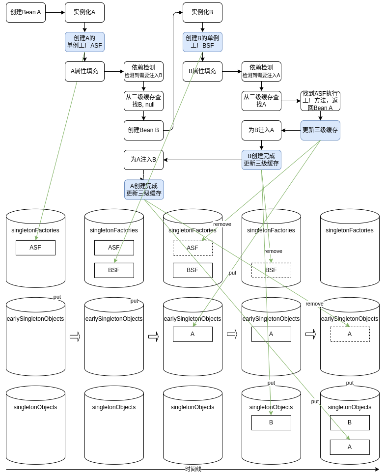
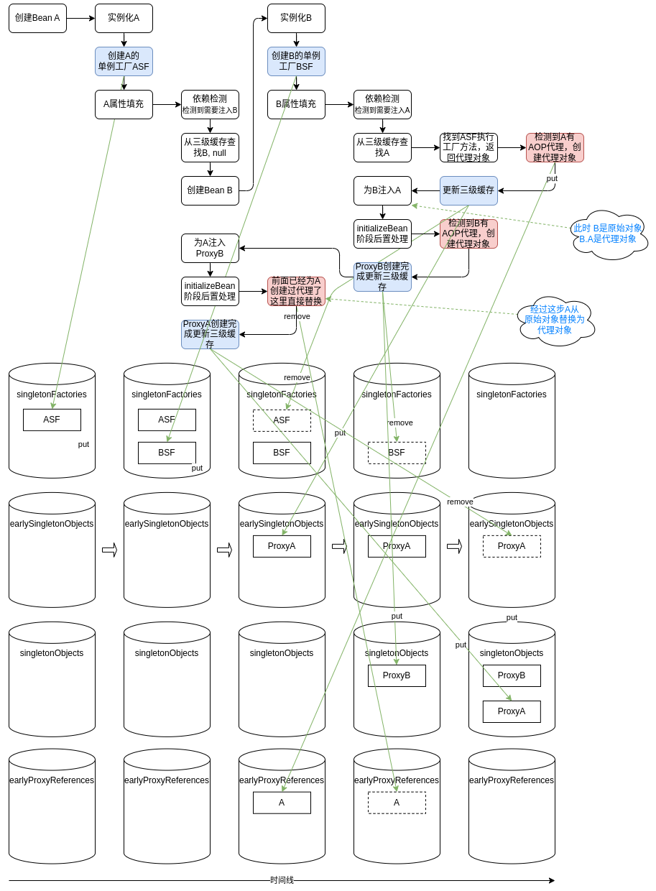
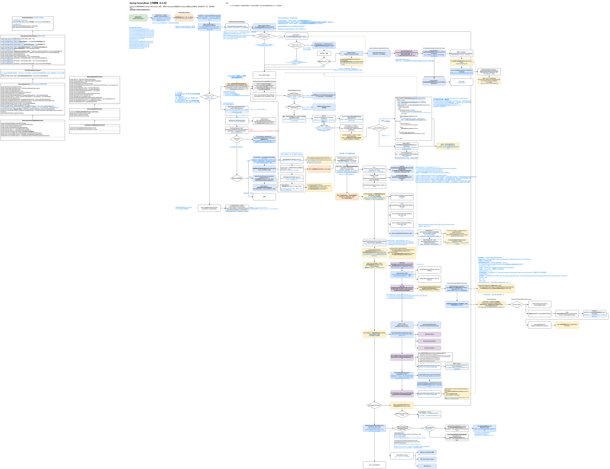

# 源码分析-Spring循环依赖的解决

测试DEMO：SpringBoot-Labs/spring-basic/spring-beans/circular-dependency。

主要依赖 `DefaultSingletonBeanRegistry` 3个容器类实现：

+ singletonObjects ConcurrentHashMap 保存已经完成初始化的单例Bean对象
+ singletonFactories HashMap 存储已经实例化但未完成初始化的Bean的单例工厂
+ earlySingletonObjects ConcurrentHashMap 保存已经实例化但未完成初始化且已经执行过单例工厂方法的单例Bean对象（这里的对象可能部分初始化）

**关于为何要使用三级缓存解决循环依赖的问题**

+ Bean实例化后为何要创建单例工厂（ObjectFactory）而不是直接保存实例化的Bean？
+ 为何要用三级缓存，而不是二级缓存？

这两个问题其实是一个问题，首先`singletonObjects`要求只能保存已经初始化完成的Bean，因为依赖注入可能需要注入多个依赖，期间Bean是个半成品，而且可能被其他Bean注入（提前暴露），就需要一个新的容器保存这个半成品，即`earlySingletonObjects`；另外为了支持AOP，没有循环依赖的情况下，Spring 都会在完成填充属性，并且执行完初始化方法之后再为其创建代理，但是如果出现了循环依赖的话，Spring 就不得不为其提前创建代理对象，否则注入的就是一个原始对象，而不是代理对象。

**简图**：

以相互依赖的两个Bean A、B为例。

**不涉及AOP代理的流程**：

**带AOP代理的流程**：

循环依赖中有代理对象通过单例工厂ObjectFactory获取Bean会复杂一点，这里面会额外有一级缓存 `earlyProxyReferences`。

**源码流程图**：

