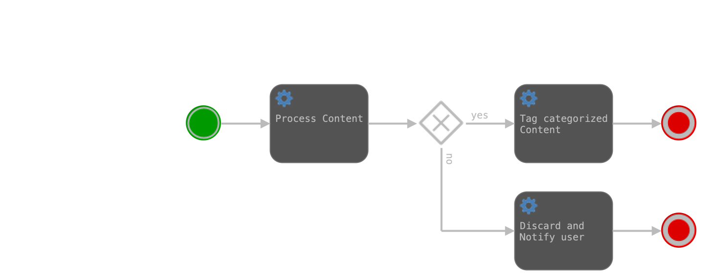

# 工作流引擎-Activiti

文档：

+ [Documentation 7.0](https://www.activiti.org/documentation)

  7.0 的文档很粗糙，猜测可能很多内容和[6.0文档](https://www.activiti.org/userguide/)一样，因此简略了，所以后面内容主要参考6.0的文档。

+ [Github](https://github.com/Activiti/Activiti)

+ 《Activiti实战》

这里不展示详细使用文档，仅梳理大纲，参考6.0文档的目录结构。


## 入门

这部分详细说明下，因为官方的入门文档写的太简略。

纯粹的示例参考：[A Guide to Activiti with Java](https://www.baeldung.com/java-activiti)

集成到Spring Boot参考官方示例，比如`activiti-api-basic-process-example`。

> Activiti 源码编译可能会遇到错误：
>
> [ERROR] Failed to execute goal org.codehaus.mojo:license-maven-plugin:2.0.1.alfresco-2:add-third-party (third-party-licenses) on project activiti-api-basic-process-example: Unable to parse configuration of mojo org.codehaus.mojo:license-maven-plugin:2.0.1.alfresco-2:add-third-party for parameter includedLicenses: Cannot set 'includedLicenses' in class org.codehaus.mojo.license.AddThirdPartyMojo: InvocationTargetException: Could not open connection to URL: https://raw.githubusercontent.com/Alfresco/third-party-license-overrides/master/includedLicenses.txt: Remote host terminated the handshake: SSL peer shut down incorrectly -> [Help 1]
>
> 参考：https://stackoverflow.com/questions/28908835/ssl-peer-shut-down-incorrectly-in-java
>
> 可以直接注释掉这个插件，这个插件只是用于帮助开发人员管理项目中的第三方软件许可证信息，注释掉对功能没有影响。

### 只依赖Activiti的示例

#### 依赖


#### 工作流程

1. 创建工作流定义BPMN文件；

2. 加载工作流配置文件（`activiti.cfg.xml`和`activiti-context.xml`），创建工作流配置`ProcessEngineConfiguration`; 并通过工作流配置创建工作流引擎`ProcessEngine`；

3. 

4. 部署工作流，通过工作流引擎的API加载并存储BPMN文件定义的工作流（工作流定义），存储到数据库；

   DemoApplication启动之后可以看到自动将

5. 启动工作流实例，就是通过工作流定义创建一个工作流流程，比如根据请求流程定义创建一个请假流程审批；

6. 如果是驱动人处理的业务，需要用户查询待办任务，处理并提交，然乎工作流引擎会自动往后面的步骤推动；

7. 工作流结束，如果任务处理完没有下一个任务节点，工作流就执行完毕了。

### activiti-api-basic-process-example

#### 依赖

SpringBoot项目中只需要引入`activiti-spring-boot-starter`。

```xml
<dependency>
  <groupId>org.activiti</groupId>
  <artifactId>activiti-spring-boot-starter</artifactId>
</dependency>
```

间接引入了下列依赖：

```
org.activiti:activiti-spring-app-process
org.activiti:activiti-spring-identity
org.activiti:activiti-spring-security
org.activiti:activiti-api-process-model
org.activiti:activiti-api-process-runtime
org.activiti:activiti-api-model-shared
org.activiti:activiti-api-runtime-shared
org.activiti:activiti-spring
org.activiti:activiti-engine
org.activiti:activiti-bpmn-model
org.activiti:activiti-api-process-runtime-impl
org.activiti:activiti-api-task-runtime-impl
org.activiti:activiti-api-process-model-impl
org.activiti:activiti-spring-process-extensions
org.activiti:activiti-api-dependencies:pom
org.activiti:activiti-core-common-dependencies:pom
```

#### 工作流BPMN文件




#### 3个源码文件

+ DemoApplication

  在`CommandLineRunner#run()`方法中打印加载的工作流定义，比如：

  ```
  > Available Process definitions: 1
  > Process definition: ProcessDefinition{
  id='categorizeProcess:1:aa1cdf55-cf31-11ee-8be9-7a3d216168b8', 
  name='categorizeProcess', 
  key='categorizeProcess', 
  description='null', 
  formKey='null', 
  version=1}
  ```

  创建了一个定时任务：每隔1s从字符串数组中随机选择一个字符串，创建工作流实例（ProcessInstance) 并启动；

  类中创建了4个Bean，`Connector processTextConnector()`、`Connector tagTextConnector()`、`Connector discardTextConnector()`、`ProcessRuntimeEventListener<ProcessCompletedEvent> processCompletedListener()`

  这四个Bean作为工作流中的组件。

  

+ DemoApplicationConfiguration + SecurityUtil

  提供了基于Spring Security实现的简单的用户名密码认证方法。认证通过后认证信息保存在线程上下文。

#### 此示例工作流程

1. 部署工作流，通过工作流引擎的API加载并存储BPMN文件定义的工作流（工作流定义），存储到数据库；

   DemoApplication启动之后可以看到自动将

2. 启动工作流实例，就是通过工作流定义创建一个工作流流程，比如根据请求流程定义创建一个请假流程审批；

3. 如果是驱动人处理的业务，需要用户查询待办任务，处理并提交，然乎工作流引擎会自动往后面的步骤推动；

4. 工作流结束，如果任务处理完没有下一个任务节点，工作流就执行完毕了。

### Activiti系统组成

+ Activiti UI

  是 Activiti 流程管理工具中的一个组件，用于提供用户界面（UI）以管理流程定义、流程实例、任务等。它是 Activiti 的可视化管理界面，为用户提供了一种直观的方式来创建、部署、监控和管理工作流程。

  页面：http://localhost:8080/activiti-app。


## 配置


## Activiti API


## Spring集成


## 部署


## BPMN2.0规范


## 表单


## JPA


## Eclipse Designer

Eclipse工作流绘图插件。


## REST API


## CDI集成


## LDAP集成


## 高级功能


## 工具


## 7.0文档

### 概述

#### 12要素应用

为了更好的拓展性，Activiti的设计遵循12要素应用的设计原则："The Twelve-Factor App": https://12factor.net。

+ One codebase, one application
+ API First
+ Dependency Management
+ Design, build, release, run
+ Configurations, credentials and code
+ Logs
+ Disposability
+ Backing services
+ Environment parity
+ Administrative processes
+ Port bindings
+ Stateless Process
+ Concurrency
+ Telemetry
+ Authentication and Authorization

#### 角色（Persona）

#### 参考

#### 云原生BPMN支持

### 入门

#### Activiti Cloud

#### Activiti Core

### Activiti Cloud 组件