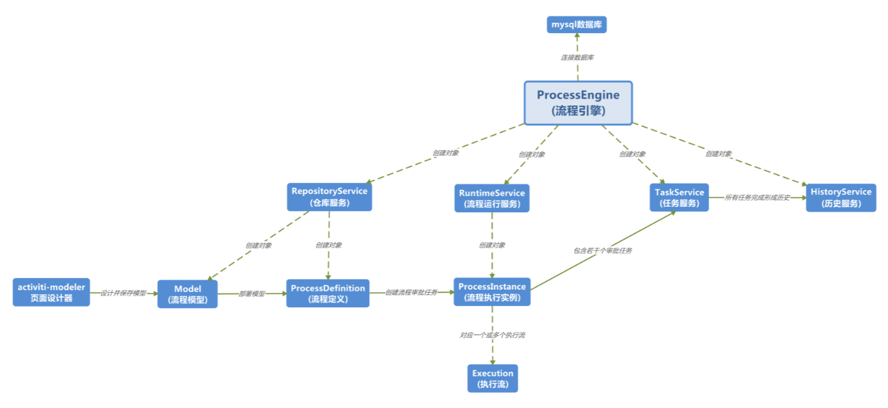

# 工作流引擎-Activiti

文档：

+ [Documentation 7.0](https://www.activiti.org/documentation)

  7.0 的文档很粗糙，猜测可能很多内容和[6.0文档](https://www.activiti.org/userguide/)一样，因此简略了，所以后面内容主要参考6.0的文档。

+ [Github](https://github.com/Activiti/Activiti)

+ 《Activiti实战》

这里不展示详细使用文档，仅梳理大纲，参考6.0文档的目录结构。


## 入门

这部分详细说明下，因为官方的入门文档写的太简略。

纯粹的示例参考：[A Guide to Activiti with Java](https://www.baeldung.com/java-activiti)

集成到Spring Boot参考官方示例，比如`activiti-api-basic-process-example`。

> Activiti 源码编译可能会遇到错误：
>
> [ERROR] Failed to execute goal org.codehaus.mojo:license-maven-plugin:2.0.1.alfresco-2:add-third-party (third-party-licenses) on project activiti-api-basic-process-example: Unable to parse configuration of mojo org.codehaus.mojo:license-maven-plugin:2.0.1.alfresco-2:add-third-party for parameter includedLicenses: Cannot set 'includedLicenses' in class org.codehaus.mojo.license.AddThirdPartyMojo: InvocationTargetException: Could not open connection to URL: https://raw.githubusercontent.com/Alfresco/third-party-license-overrides/master/includedLicenses.txt: Remote host terminated the handshake: SSL peer shut down incorrectly -> [Help 1]
>
> 参考：https://stackoverflow.com/questions/28908835/ssl-peer-shut-down-incorrectly-in-java
>
> 可以直接注释掉这个插件，这个插件只是用于帮助开发人员管理项目中的第三方软件许可证信息，注释掉对功能没有影响。

### 只依赖Activiti的示例

参考：SpringBoot-Labs/workflow/activiti-simple-examples。

#### 依赖

```xml
<dependency>
    <groupId>org.activiti</groupId>
    <artifactId>activiti-engine</artifactId>
</dependency>
```

#### 工作流程

1. **创建工作流定义BPMN文件**；

2. **加载工作流配置文件（`activiti.cfg.xml`和`activiti-context.xml`），先创建工作流配置`ProcessEngineConfiguration`; 然后通过工作流配置创建工作流引擎`ProcessEngine`；**

   创建工作流程引擎过程中初始化了很多组件，参考`ProcessEngineImpl#init()`，比如数据库`activiti`中表的创建。

   关于创建的数据表的解释：[数据库表明解释](#数据库表明解释) 。

   > activiti.cfg.xml 和 activiti-context.xml 这两个用于创建工作流配置的文件的区别？
   >
   > 对于所有 activiti.cfg.xml 文件，将以典型方式创建 ProcessEngine（内部也有使用Spring IoC）。对于所有 activiti-context.xml 文件，它将以 Spring 方式创建（将创建 Spring 应用程序上下文并从中获取 ProcessEngine）。
   >
   > 为了查看数据表操作，可以在日志配置中添加：
   >
   > ```xml
   > <!-- 打印sql语句，查源码日志发现在sql语句的日志在 org.activiti.engine.impl.db.DbSqlSession -->
   > <logger name="org.activiti.engine.impl.db" level="DEBUG"/>
   > ```

3. **部署工作流，即通过工作流引擎的`RepositoryService` API加载BPMN文件定义的工作流转换为工作流定义（ProcessDefinition），并存储到数据库；**

   比如部署 vocation-request.bpmn20.xml, 

   > RepositoryService 帮助我们管理流程定义和操纵流程定义的部署（`Deployment`）。该服务处理与流程定义相关的静态数据。

5. **启动工作流（ProcessInstance）**，即通过工作流定义创建一个运行的工作流流程，比如根据请求流程定义创建一个请假流程审批；

6. 如果是驱动人处理的业务，需要用户查询待办任务，处理并提交，然乎工作流引擎会自动往后面的步骤推动；

6. **工作流结束**，如果任务处理完没有下一个任务节点，工作流就执行完毕了。

#### activiti 数据表

参考后面[配置](#配置)。

### activiti-api-basic-process-example

#### 依赖

SpringBoot项目中只需要引入`activiti-spring-boot-starter`。

```xml
<dependency>
  <groupId>org.activiti</groupId>
  <artifactId>activiti-spring-boot-starter</artifactId>
</dependency>
```

#### 工作流BPMN文件


#### 3个源码文件

+ DemoApplication

  在`CommandLineRunner#run()`方法中打印加载的工作流定义，比如：

  ```
  > Available Process definitions: 1
  > Process definition: ProcessDefinition{
  id='categorizeProcess:1:aa1cdf55-cf31-11ee-8be9-7a3d216168b8', 
  name='categorizeProcess', 
  key='categorizeProcess', 
  description='null', 
  formKey='null', 
  version=1}
  ```

  创建了一个定时任务：每隔1s从字符串数组中随机选择一个字符串，创建工作流实例（ProcessInstance) 并启动；

  类中创建了4个Bean，`Connector processTextConnector()`、`Connector tagTextConnector()`、`Connector discardTextConnector()`、`ProcessRuntimeEventListener<ProcessCompletedEvent> processCompletedListener()`

  这四个Bean作为工作流中的组件。

  

+ DemoApplicationConfiguration + SecurityUtil

  提供了基于Spring Security实现的简单的用户名密码认证方法。认证通过后认证信息保存在线程上下文。

#### 此示例工作流程

1. 部署工作流，通过工作流引擎的API加载并存储BPMN文件定义的工作流（工作流定义），存储到数据库；

   DemoApplication启动之后可以看到自动将

2. 启动工作流实例，就是通过工作流定义创建一个工作流流程，比如根据请求流程定义创建一个请假流程审批；

3. 如果是驱动人处理的业务，需要用户查询待办任务，处理并提交，然乎工作流引擎会自动往后面的步骤推动；

4. 工作流结束，如果任务处理完没有下一个任务节点，工作流就执行完毕了。

### Activiti系统组成

+ Activiti UI

  是 Activiti 流程管理工具中的一个组件，用于提供用户界面（UI）以管理流程定义、流程实例、任务等。它是 Activiti 的可视化管理界面，为用户提供了一种直观的方式来创建、部署、监控和管理工作流程。

  页面：http://localhost:8080/activiti-app。


## 配置

### [数据库表名解释](https://www.activiti.org/userguide/#database.tables.explained)

Activiti的数据库名称均以ACT_开头。第二部分是表用例的双字符标识。此用例也将大致匹配服务 API。

+ ACT_RE_*：RE 代表 **repository**。带有此前缀的表包含静态信息，例如流程定义和流程资源（图像、规则等）。
+ ACT_RU_*：RU 代表 **runtime**。这些是运行时表，包含流程实例、用户任务、变量、作业等的运行时数据。Activiti <u>仅在流程实例执行期间存储运行时数据</u>，并在<u>流程实例结束时删除记录</u>。这使得运行时表小而快。
+ ACT_ID_*：ID 代表 **identity**。这些表包含身份信息，例如用户、组等。
+ ACT_HI_*：HI 代表 **history**。这些表包含历史数据，例如过去的流程实例、变量、任务等。
+ ACT_GE_*：**general ** 数据，用于各种用例。

> 梳理清流程实例中对数据表的操作和各表的功能后就基本梳理清除了Activiti的工作流程原理。
>
> 调试时可以同时监听数据库的 binlog 日志，了解流程内部控制原理。

| 表名                    | 描述                                                         |
| ----------------------- | ------------------------------------------------------------ |
| ACT_EVT_LOG             |                                                              |
| **ACT_GE_BYTEARRAY**    | 流程模型文件。其中 BYTES_ 保存文件内容                       |
| ACT_GE_PROPERTY         | 系统相关属性                                                 |
| **ACT_HI_ACTINST**      | 历史活动信息，记录流程流转过的所有节点，ACT_HI_TASKINST 仅仅记录UserTask信息。 |
| ACT_HI_ATTACHMENT       | 历史流程附件                                                 |
| ACT_HI_COMMENT          | 历史说明性信息                                               |
| **ACT_HI_DETAIL**       | 历史流程细节信息，主要存储流程中产生的变量详细信息，包括流转的变量等；<br />`NAME_`：变量名称，`VAR_TYPE_ `: 变量类型，提供了`DOUBLE_`、`LONG_`、`TEXT_`、`TEXT2_` 4种类型字段存储变量的值 |
| **ACT_HI_IDENTITYLINK** | 历史流程运行过程中参与者的信息                               |
| **ACT_HI_PROCINST**     | 历史流程实例信息                                             |
| **ACT_HI_TASKINST**     | 历史任务实例，每个任务对应一条数据，包含所属执行流程ID、任务的基本信息、任务的执行时间等信息 |
| **ACT_HI_VARINST**      | 历史流程运行中的变量信息，类似 ACT_HI_DETAIL 存储的内容      |
| ACT_ID_GROUP            | 身份信息-组信息                                              |
| ACT_ID_INFO             | 身份信息-组信息                                              |
| ACT_ID_MEMBERSHIP       | 身份信息-用户和组关系的中间表                                |
| ACT_ID_USER             | 身份信息-用户信息                                            |
| ACT_PROCDEF_INFO        | ACT_RE_PROCDEF 的拓展表，关联ACT_GE_BYTEARRAY与ACT_RE_PROCDEF表 |
| **ACT_RE_DEPLOYMENT**   | 流程部署信息，比如部署的流程名称、分类、租户ID、部署时间等等，一个流程可以部署多次比如针对不同的租户 |
| **ACT_RE_MODEL**        | 流程模型，Model是流程模型的元数据和源的容器，通常可以在建模环境中进行编辑；<br />`EDITOR_SOURCE_VALUE_ID_`: 存储BPMN定义内容的ID，<br />`EDITOR_SOURCE_EXTRA_VALUE_ID_` : 存储BPMN额外的资源内容的ID，<br />这些内容在ACT_GE_BYTEARRAY表中存储 |
| **ACT_RE_PROCDEF**      | 已部署的流程定义信息（即 Process Definition），一个模型可以有多个流程定义。比如针对不同的租户或不同的流程定义版本。<br />KEY_ VERSION_ TENANT_ID 组成组合索引；<br />ID_ = `KEY_:VERSION_:DEPLOYMENT_ID_`, 通过DEPLOYMENT_ID_字段与ACT_RE_DEPLOYMENT表关联 |
| ACT_RU_DEADLETTER_JOB   |                                                              |
| ACT_RU_EVENT_SUBSCR     | 运行中的流程的事件                                           |
| **ACT_RU_EXECUTION**    | 运行中的流程执行记录，存储正在执行的流程中的任务实例信息     |
| **ACT_RU_IDENTITYLINK** | 运行中的流程参与人员信息，主要存储任务节点与参与者相关信息   |
| ACT_RU_JOB              | 运行中的流程的作业                                           |
| ACT_RU_SUSPENDED_JOB    |                                                              |
| **ACT_RU_TASK**         | 当前运行的任务数据信息                                       |
| ACT_RU_TIMER_JOB        | 定时执行的任务数据信息                                       |
| **ACT_RU_VARIABLE**     | 运行中的流程的变量参数信息                                   |

> 详情参考：[分析activiti表](https://blog.csdn.net/LSY_CSDN_/article/details/104713796#t13)。

### 作业执行器

### 事件处理

#### 事件监听器的实现与注册

只需要实现`org.activiti.engine.delegate.event.ActivitiEventListener`接口，然后通过 Spring bean:property 注册事件监听器到工作流引擎配置类的`eventListeners`。

`ActivitiEvent`接口描述的事件和BPMN中的事件貌似不是同一个概念，这里的事件更像是生命周期事件，是用于给外部listeners监听的发生在Activiti 引擎中的事件，[支持的事件类型](https://www.activiti.org/userguide/#eventDispatcherEventTypes)。

比如测试`QuickStartTest#testProcessInstanceHandling()`中监听到的事件类型：

```
Event received: ENGINE_CREATED
Event received: ENTITY_CREATED
Event received: ENTITY_INITIALIZED
Event received: ENTITY_CREATED
Event received: ENTITY_INITIALIZED
Event received: ENTITY_CREATED
Event received: ENTITY_CREATED
Event received: ENTITY_INITIALIZED
Event received: ENTITY_INITIALIZED
Event received: ENTITY_CREATED
Event received: ENTITY_INITIALIZED
Event received: ENTITY_CREATED
Event received: ENTITY_INITIALIZED
Event received: VARIABLE_CREATED
Event received: ENTITY_CREATED
Event received: HISTORIC_PROCESS_INSTANCE_CREATED
Event received: VARIABLE_UPDATED
Event received: ENTITY_CREATED
Event received: ENTITY_INITIALIZED
Event received: ENTITY_CREATED
Event received: ENTITY_INITIALIZED
Event received: VARIABLE_CREATED
Event received: ENTITY_CREATED
Event received: ENTITY_INITIALIZED
Event received: ENTITY_CREATED
Event received: ENTITY_INITIALIZED
Event received: VARIABLE_CREATED
Event received: ENTITY_INITIALIZED
Event received: ENTITY_CREATED
Event received: ENTITY_INITIALIZED
Event received: PROCESS_STARTED
Event received: ENTITY_CREATED
Event received: ENTITY_INITIALIZED
Event received: HISTORIC_ACTIVITY_INSTANCE_CREATED
Event received: ACTIVITY_STARTED
Event received: HISTORIC_ACTIVITY_INSTANCE_ENDED
Event received: ACTIVITY_COMPLETED
...
Event received: SEQUENCEFLOW_TAKEN
Event received: ENTITY_CREATED
Event received: ENTITY_INITIALIZED
Event received: HISTORIC_ACTIVITY_INSTANCE_CREATED
Event received: ACTIVITY_STARTED
Event received: PROCESS_CANCELLED
Event received: ACTIVITY_CANCELLED
Event received: HISTORIC_ACTIVITY_INSTANCE_ENDED
Event received: ENTITY_DELETED
...
Event received: ENTITY_DELETED
Event received: VARIABLE_DELETED
Event received: ENTITY_DELETED
Event received: HISTORIC_PROCESS_INSTANCE_ENDED
Event received: ENGINE_CLOSED
```

**事件监听器中事件过滤**（只关注某些事件）:

```xml
<property name="typedEventListeners">
    <map>
        <!-- 关注的事件 -> 对应监听器的列表 -->
        <entry key="ENGINE_CREATED,ENGINE_CLOSED,ACTIVITY_STARTED,ACTIVITY_COMPLETED,TASK_CREATED,TASK_COMPLETED,JOB_EXECUTION_SUCCESS,JOB_EXECUTION_FAILURE" >
            <list>
                <bean class="top.kwseeker.labs.activiti.simple01.MyEventListener" />
            </list>
        </entry>
        <!-- 还可以添加其他映射 -->
    </map>
</property>
```

#### 在运行时添加监听器

#### [将监听器添加到流程定义](https://www.activiti.org/userguide/#eventDispatcherConfigurationProcessDefinition)

前面添加监听器是全局的监听器，会监听任何流程中的事件，如果想**添加只监听某个流程的监听器**可以将监听器只添加到流程定义。

在BPMN文件中process元素中配置。

**监听器抛出 BPMN 事件**


## Activiti API

通过Activiti API可以将Activiti框架嵌入到应用中使用，后面还提供了REST API即可以将Activity当做中间件部署。



这些API包含很多借助MyBatis读写数据库的操作，看源码发现`org.activiti.engine.impl.db.DbSqlSession`会打印SQL操作日志但是没有具体的sql语句，后面的逻辑的代码以及Mybatis都没有打印SQL日志，另外Activiti是使用Mybatis `DefaultSqlSession`与数据库建立连接的可以在这里加断点查看操作的sql。

另外如果配置了Druid可以通过它的监控页面查看sql或通过数据库的binlog日志查看。


## Spring集成

### [Spring Boot 集成](https://www.activiti.org/userguide/#springSpringBoot)

6.0文档说只需要引入依赖**`activiti-spring-boot-starter-basic`**, 7.0则是**`activiti-spring-boot-starter`**。

```xml
<dependency>
	<groupId>org.activiti</groupId>
	<artifactId>activiti-spring-boot-starter-basic</artifactId>
	<version>6.0.0</version>
</dependency>
```

6.0间接引入依赖：

```
org.activiti:activiti-engine:6.0.0
org.activiti:activiti-spring:6.0.0
org.springframework.boot:spring-boot-starter-jdbc:1.2.6.RELEASE
```

7.0间接引入依赖：

```xml
org.activiti:activiti-spring-app-process:7.0.0.GA
org.activiti.core.common:activiti-spring-identity:7.0.0.GA
org.activiti.core.common:activiti-spring-security:7.0.0.GA
org.activiti.api:activiti-api-process-model:7.0.0.GA
org.activiti.api:activiti-api-process-runtime:7.0.0.GA
org.activiti.api:activiti-api-process-model-impl:7.0.0.GA
org.activiti.api:activiti-api-model-shared:7.0.0.GA
org.activiti.api:activiti-api-runtime-shared:7.0.0.GA
org.activiti:activiti-spring:7.0.0.GA
org.activiti:activiti-engine:7.0.0.GA
org.activiti:activiti-bpmn-model:7.0.0.GA
org.activiti:activiti-api-process-runtime-impl:7.0.0.GA
org.activiti:activiti-api-task-runtime-impl:7.0.0.GA
org.activiti:activiti-spring-process-extensions:7.0.0.GA
org.springframework:spring-context:5.1.4.RELEASE
org.springframework:spring-tx:5.1.4.RELEASE
org.springframework:spring-beans:5.1.4.RELEASE
org.springframework:spring-core:5.1.4.RELEASE
org.springframework.boot:spring-boot:2.1.2.RELEASE
org.springframework.boot:spring-boot-autoconfigure:2.1.2.RELEASE
org.springframework.security:spring-security-core:5.1.3.RELEASE
org.slf4j:slf4j-api:1.7.25
com.fasterxml.uuid:java-uuid-generator:3.1.4
com.fasterxml.jackson.core:jackson-annotations:2.9.0
org.springframework.boot:spring-boot-starter-actuator:2.1.2.RELEASE
org.activiti.build:activiti-parent:pom:7.0.0.GA
org.activiti.api:activiti-api-dependencies:pom:7.0.0.GA
org.activiti.core.common:activiti-core-common-dependencies:pom:7.0.0.GA
```

另外**Activiti还需要数据库存储数据，所以额外引入数据库驱动**，比如 mysql-connector-java。

添加依赖后启动 SpringBoot 应用 @EnableAutoConfiguration幕后做的事情：

- 内存中的数据源会自动创建并传递到 Activiti 流程引擎配置
- 创建 Activiti ProcessEngine bean
- 所有 Activiti 服务都作为 Spring beans 公开
- 创建作业执行器

另外还可能需要**配置数据库连接、数据库连接池**，按 SpringBoot 的方式配置即可。


## [部署](https://www.activiti.org/userguide/#chDeployment)

即如何部署BPMN工作流模型。


## [BPMN2.0规范](https://www.activiti.org/userguide/#bpmn20)

### [Custom extensions](https://www.activiti.org/userguide/#bpmnCustomExtensions)

### [Events](https://www.activiti.org/userguide/#bpmnEvents)

BPMN2.0 **事件定义类型**（Event Definition，用于定义后面的事件的）:

| 事件定义类型              | 描述                                                         |
| ------------------------- | ------------------------------------------------------------ |
| Timer Event Definitions   | 定时器事件是由定义的定时器触发的事件。它们可以用作开始事件、中间事件或边界事件。时间事件的行为取决于所使用的业务日历。每个计时器事件都有一个默认的业务日历，但也可以在计时器事件定义上定义业务日历。 |
| Error Event Definitions   | BPMN 错误事件是一种对业务异常进行建模的方法。 Java 异常以自己特定的方式进行处理。 |
| Signal Event Definitions  | 信号事件是引用命名信号的事件。信号是全局范围的事件（广播语义），并被传递到所有活动处理程序（等待流程实例/捕获信号事件）。 |
| Message Event Definitions | 消息事件是引用命名消息的事件。消息有名称和有效负载。与信号不同，消息事件始终针对单个接收者。 |

BPMN2.0 定义了多种**事件类型**：

> 注意**BPMN事件**和**ActivitiEvent**不是同一个概念。

| 事件类型                                 | 描述                                                         |
| ---------------------------------------- | ------------------------------------------------------------ |
| **Start Events**                         | 指示进程从何处开始。启动事件的类型（流程在消息到达时启动、在特定时间间隔启动等），定义流程如何启动，在事件的可视化表示中显示为小图标。在 XML 表示中，类型由子元素的声明给出。 |
| None Start Event                         | 无启动事件意味着启动流程实例的触发器未指定。这意味着引擎无法预测流程实例何时必须启动。当通过 API 通过调用 startProcessInstanceByXXX 方法之一启动流程实例时，将使用 none 启动事件。 |
| Timer Start Event                        | 用于在给定的时间创建流程实例。它既可用于仅启动一次的进程，也可用于应在特定时间间隔启动的进程。 |
| Message Start Event                      | 可用于使用命名消息启动流程实例。这有效地允许我们使用消息名称从一组替代启动事件中选择正确的启动事件。 |
| Signal Start Event                       | 可用于使用命名信号启动流程实例。可以使用中间信号抛出事件或通过 API（runtimeService.signalEventReceivedXXX 方法）从流程实例内激发信号。在这两种情况下，将启动具有同名信号启动事件的所有流程定义。 |
| Error Start Event                        | 可用于触发事件子流程。错误启动事件不能用于启动流程实例。     |
| **End Events**                           | 结束事件表示（子）流程（路径）的结束。这意味着当流程执行到达结束事件时，会抛出一个结果。 |
| None End Event                           | 无结束事件意味着到达该事件时抛出的结果是未指定的。因此，除了结束当前的执行路径之外，引擎不会做任何额外的事情。 |
| Error End Event                          | 当流程执行到达错误结束事件时，当前执行路径结束并抛出错误。该错误可以通过匹配的中间边界错误事件捕获。如果没有找到匹配的边界错误事件，则会抛出异常。 |
| Terminate End Event                      | 当到达终止结束事件时，当前流程实例或子流程将被终止。         |
| Cancel End Event                         | 取消结束事件只能与 bpmn 事务子流程结合使用。当到达取消结束事件时，将引发取消事件，该事件必须由取消边界事件捕获。然后取消边界事件取消事务并触发补偿。 |
| **Boundary Events**                      |                                                              |
| Timer Boundary Event                     | 计时器边界事件充当秒表和闹钟。当执行到达边界事件所附加的活动时，计时器就会启动。当计时器触发时（例如，在指定的时间间隔后），活动将被中断，随后发生边界事件。 |
| Error Boundary Event                     |                                                              |
| Signal Boundary Event                    |                                                              |
| Message Boundary Event                   |                                                              |
| Cancel Boundary Event                    |                                                              |
| Compensation Boundary Event              |                                                              |
| **Intermediate Catching Events**         |                                                              |
| Timer Intermediate Catching Event        |                                                              |
| Signal Intermediate Catching Event       |                                                              |
| Message Intermediate Catching Event      |                                                              |
| Intermediate Throwing Event              |                                                              |
| Intermediate Throwing None Event         |                                                              |
| Signal Intermediate Throwing Event       |                                                              |
| Compensation Intermediate Throwing Event |                                                              |

**属性和元素**：

+ initiator

  标识进程启动时将在其中存储经过身份验证的用户 ID 的**变量名称**。

**事件处理**：

参考[配置](#配置)。

### [Sequence Flow](https://www.activiti.org/userguide/#bpmnSequenceFlow)

### [Gateways](https://www.activiti.org/userguide/#bpmnGateways)

### [Tasks](https://www.activiti.org/userguide/#bpmnTask)

BPMN2.0 定义了很多任务类型，比如 UserTask、ScriptTask、Java Service Task、Web Service Task、Business Rule Task、Email Task、Mule Task、Camel Task、Menu Task、Java Receive Task、Shell Task。

| 任务类型           | 描述                                                         |
| ------------------ | ------------------------------------------------------------ |
| **UserTask**       | 用于对需要由人类参与者完成的工作进行建模。当流程执行到达此类任务时，将在分配该任务的用户或组的任务列表中创建一个新任务实例。 |
| Script Task        | 是一种自动活动。当一个流程执行到达脚本任务时，就会执行相应的脚本。 |
| Java Service Task  | 用于调用外部Java 类。                                        |
| Web Service Task   | 用于同步调用外部Web 服务。                                   |
| Business Rule Task | 用于同步执行一个或多个规则。 Activiti 使用 Drools Expert（Drools 规则引擎）来执行业务规则。目前，包含业务规则的 .drl 文件必须与定义业务规则任务以执行这些规则的流程定义一起部署。这意味着流程中使用的所有 .drl 文件都必须打包在流程 BAR 文件中，例如任务表单。有关为 Drools Expert 创建业务规则的更多信息，请参阅 JBoss Drools 上的 Drools 文档。 |
| Email Task         | Activiti 允许通过自动邮件服务任务来增强业务流程，这些任务将电子邮件发送给一个或多个收件人，包括对抄送、密件抄送、HTML 内容等的支持。请注意，邮件任务不是 BPMN 2.0 的正式任务规范（因此它没有专用图标）。因此，在 Activiti 中，邮件任务被实现为专用服务任务。 |
| Mule Task          | 允许向 Mule 发送消息，增强 Activiti 的集成功能。请注意，Mule Task 不是 BPMN 2.0 规范的正式任务（因此它没有专用图标）。因此，在 Activiti 中，mule 任务被实现为专用服务任务。<br />[Mule](https://github.com/mulesoft/mule) 和后下面的 [Camel](https://github.com/apache/camel) 是两个开源的集成框架。 |
| Camel Task         | 允许向 Camel 发送消息和从 Camel 接收消息，从而增强了 Activiti 的集成功能。请注意，Camel 任务不是 BPMN 2.0 规范的官方任务（因此它没有专用图标）。因此，在 Activiti 中，Camel 任务被实现为专用服务任务。另请注意，在项目中包含 Activiti Camel 模块以使用 Camel 任务功能。 |
| Manual Task        | 定义 BPM 引擎外部的任务。它用于对某人完成的工作进行建模，引擎不需要知道这些工作，也没有系统或 UI 界面。对于引擎来说，手动任务被作为传递活动处理，从流程执行到达的那一刻起自动继续该流程。 |
| Java Receive Task  | Receive Task 是等待特定消息到达的简单任务。目前，我们仅为此任务实现了 Java 语义。当流程执行到达接收任务时，流程状态将提交到持久性存储。这意味着进程将保持在此等待状态，直到引擎接收到特定消息，这会触发进程继续执行Receive Task。 |
| Shell Task         | 允许运行 shell 脚本和命令。请注意，Shell 任务不是 BPMN 2.0 规范的正式任务（因此它没有专用图标）。 |

#### User Task

用户任务XML定义属性与元素：

+ id

+ name

+ documentation

  用户任务描述。

+ activiti:dueDate

  任务截止日期。

  一个流程中的多个任务截止日期可能有依赖，可以通过 `TaskService` 或者在`TaskListener`中使用传递的参数`DelegateTask`，修改。

+ **用户指派**

  用户任务需要人类手动处理，但是任务指派给谁处理呢，Activiti提供了下面几种方式：

  + humanPerformer

    可以指定任务要指派的用户，这种方式只能指定一个人。

    > 被指派的用户被称为受让人（assignee）。

  + potentialOwner

    指定潜在候选人，可以指定用户和用户组。不指明默认是用户组

    ```xml
    <formalExpression>user(kermit), group(management)</formalExpression>
    <!-- 这里表示用户组 -->
    <formalExpression>accountancy</formalExpression>
    ```

  + activiti:assignee

  + activiti:candidateUsers

  + activiti:candidateGroups

  + extensionElements

    支持自定义拓展，从而可以定义复杂的指派，TODO。

  另外Activiti在嵌入到应用程序中时能够与现有的身份管理解决方案集成，TODO。

#### [流程执行监听器（Execution Listener）](https://www.activiti.org/userguide/#executionListeners)

可以在流程执行期间发生某些事件时执行外部 Java 代码或计算表达式。可以捕获的事件有：

- Start and ending of a process instance.
- Taking a transition.
- Start and ending of an activity.
- Start and ending of a gateway.
- Start and ending of intermediate events.
- Ending a start event or starting an end event.

#### [任务监听器（Task Listener）](https://www.activiti.org/userguide/#taskListeners)

用于在发生特定任务相关事件时执行自定义 Java 逻辑或表达式。任务监听器只能作为用户任务的子元素添加到流程定义中。

需要实现`org.activiti.engine.delegate.TaskListener`接口。


### [Sub-Processes and Call Activities](https://www.activiti.org/userguide/#bpmnSubprocessAndCallActivity)

### [Transactions and Concurrency](https://www.activiti.org/userguide/#bpmnConcurrencyAndTransactions)


## 表单


## JPA


## Eclipse Designer

Eclipse工作流绘图插件。


## REST API


## CDI集成


## LDAP集成


## 高级功能


## 工具

